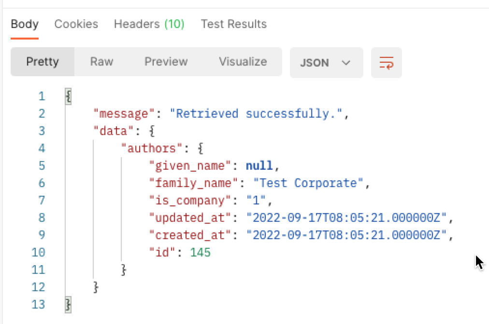
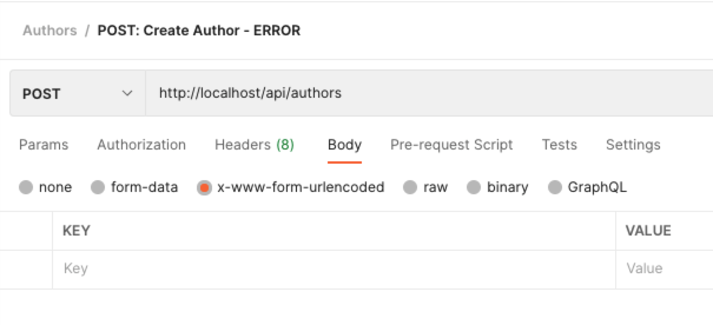

# Making an API II - Inserting Data

In [API part I](ReadMe-API-1-index-show.md) we looked at how to query the data via
an API in the Index and Show methods.

The Index is NOT paginated (a problem for a later step), so we retrieve
ALL the records (even if we had 1,000,000 of them)!

# The Steps

- [Introduction](ReadMe-API-0-introduction.md)  🔗
- [Index and Show](ReadMe-API-1-index-show.md)  🔗
- [Create](ReadMe-API-2-create.md)  🔗
- [Update](ReadMe-API-3-update.md)  🔗
- [Delete](Readme-API-4-delete.md)  🔗
- [Exercises](Readme-API-5-exercises.md)  🔗
- [Documenting API](ReadMe-API-6-documenting.md)  🔗
- [Pagination](ReadMe-API-7-pagination.md)  🔗
- [Authentication](ReadMe-API-8-authentication.md)  🔗

# Author API - Create a New Author

As we have employed Resourceful Routing, we do not need to create a
specific route. :smile:

Our exising `routes/api.php` file has this:

```php
Route::resource('authors', \App\Http\Controllers\API\AuthorAPIController::class);
```

You can also use the following:

```php
Route::resource('authors', AuthorAPIController::class);
```

This means we can now concentrate on the `API/AuthorAPIController.php`
file and the `store`method.

## Store API Method

Let's start by creating the required API call for the
`http://DOMAIN/api/authors` endpoint.

| Request                   | HTTP Verb | Response                                               |
| ------------------------- |:---------:|--------------------------------------------------------|
| http://DOMAIN/api/authors |   POST    | request result code (201), message and author as JSON  |

We want our method to do the following:

- Validate the author data
- Store the new author
- Return a JSON response with:
    - A message - something to send to the caller that may be displayed as
      a message to the user
    - The list of authors
    - Response code of `201, Created`

### Validate Submitted Data

To perform validation in the best way we need to make use of a Store Request.
The Requests are kept in the `app/Http/Requests` folder.

To create the Request Stub we use the command:

```shell
sail artisan make:request StoreAuthorAPIRequest
```

We now edit the `StoreAuthorAPIRequest.php` file and make the following
modifications...

At the top of the file, add the two extra lines to import HTTP Response
Exceptions and the Validator contract:

```php
use Illuminate\Foundation\Http\FormRequest;
use Illuminate\Http\Exceptions\HttpResponseException;
use Illuminate\Contracts\Validation\Validator;
```

We are currently not checking to see if the user is logged in so change
the `authorised` method to return `true`.

Next we add the validation code to the rules array:
```php
'given_name' => [
    'max:64'
],
'family_name' => [
    'required_without:given_name',
    'max:128'
],
```


Edit the `AuthorAPIController` and add the following to the store method:

```php
$validated = $request->validated();  // get validated data
$validated['is_company'] = $validated['is_company'] ?? 0;  // Default to false
$author = Author::create($validated); // create the author

return response()->json(
    [
        'success' => true,
        'message' => "Created successfully.",
        'data' => [
            'authors' => $author,
        ],
    ],
    200
);
```

## Testing with Postman

Because we are sending data to the API we cannot use the brute force
check via the browser.

We need to use Postman to do the testing. In this test we are not using
authenticated access. 

A suitable postman request could be as shown below:


The second image shows a corporate author being added:


The resulting response from the request is:



If an incorrect request is made, for instance no values are sent then
we get suitable errors.

Requests with missing data:




Responses with errors:


## Exercises

Complete each of these exercises:

### TODO: Create the Books API create endpoint

- Add the `create` method to `BooksAPIController.php`.
- Make sure you verify all the required data is submitted.
- If the data is not submitted, it will return HTML for the time being,
  this is ok, until we look at error responses in a later stage.
- Store the new book in the database.

### TODO: Test the create method

- Create a suitable test in Postman to verify that you create a record
  using the API only.
- Create a test to check that missing data provides the expected error
  messages in response.

### TODO: Add the book - Author relationship

- Update the book create API endpoint so that when a book is added,
  its author is linked via the author-book model.
- The Author is passed as TWO text fields: family name(s) or corporate 
  name, and an optional, null if omitted, given name(s).
- Use these two fields to check if the author exists, and if so use
  that id.
- If author is missing, create the author first, then use the new 
  author's ID as the id.
- Refer to the seeders for help on this one.

### TODO: Test the updated create method

- Create a suitable test in Postman to verify that you create a
  record (and link the associated author) using the API only.

### TODO: Add multiple authors to a book

- When submitting the author details, allow for an 'array of authors' 
  (with family name(s) or corporate name, and an optional, null if 
  omitted, given name(s) for each author).
- Use this to add multiple authors, in a similar way to the previous 
  problem.

### TODO: Update Author Create Request
Four improvements to be done with the author's create request:

- Update the author create so that if the author already exists then
  the author is returned.
- Ensure a suitable error message is given.
- Provide a suitable response code of 202 to represent the author was 
  accepted but not created.
- If the author's given name is provided, and the family name is 
  missing, move the given name into the family name.
