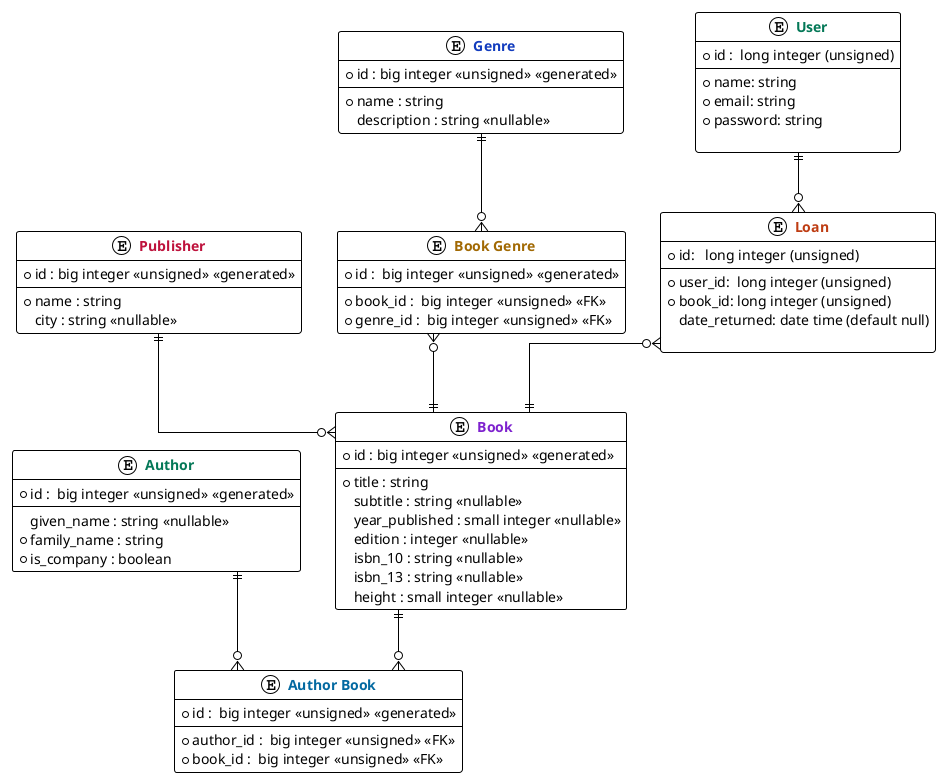

# Library ER Diagram

Mermaid version contains latest updates to the ERD.

```plantuml
@startuml

    skinparam linetype ortho
    !theme plain

    entity "<color:#be3c12>**Loan**</color>" as ln {
        * id:   long integer (unsigned)
        --
        * user_id:  long integer (unsigned)
        * book_id: long integer (unsigned)
        date_returned: date time (default null)

    }

    entity "<color:#047857>**User**</color>" as usr {
        * id :  long integer (unsigned)
        --
        * name: string
        * email: string
        * password: string

    }

    entity "<color:#047857>**Author**</color>" as aut {
        * id :  big integer <<unsigned>> <<generated>>
        --
        given_name : string <<nullable>>
        * family_name : string
        * is_company : boolean
    }

    entity "<color:#0369a1>**Author Book**</color>" as ab {
        * id :  big integer <<unsigned>> <<generated>>
        --
        * author_id :  big integer <<unsigned>> <<FK>>
        * book_id :  big integer <<unsigned>> <<FK>>
    }

    entity "<color:#7e22ce>**Book**</color>" as bk {
        * id : big integer <<unsigned>> <<generated>>
        --
        * title : string
        subtitle : string <<nullable>>
        year_published : small integer <<nullable>>
        edition : integer <<nullable>>
        isbn_10 : string <<nullable>>
        isbn_13 : string <<nullable>>
        height : small integer <<nullable>>
    }

    entity "<color:#be123c>**Publisher**</color>" as pub {
        * id : big integer <<unsigned>> <<generated>>
        --
        * name : string
        city : string <<nullable>>
    }

    entity "<color:#123cbe>**Genre**</color>" as gen {
        * id : big integer <<unsigned>> <<generated>>
        --
        * name : string
        description : string <<nullable>>
    }


    entity "<color:#a16903>**Book Genre**</color>" as bg {
        * id :  big integer <<unsigned>> <<generated>>
        --
        * book_id :  big integer <<unsigned>> <<FK>>
        * genre_id :  big integer <<unsigned>> <<FK>>
    }

aut ||--o{ ab
bk ||--o{ ab
pub ||--o{ bk
gen ||--o{ bg
bg }o--|| bk
usr ||--o{ ln
ln }o--|| bk

@enduml

```
