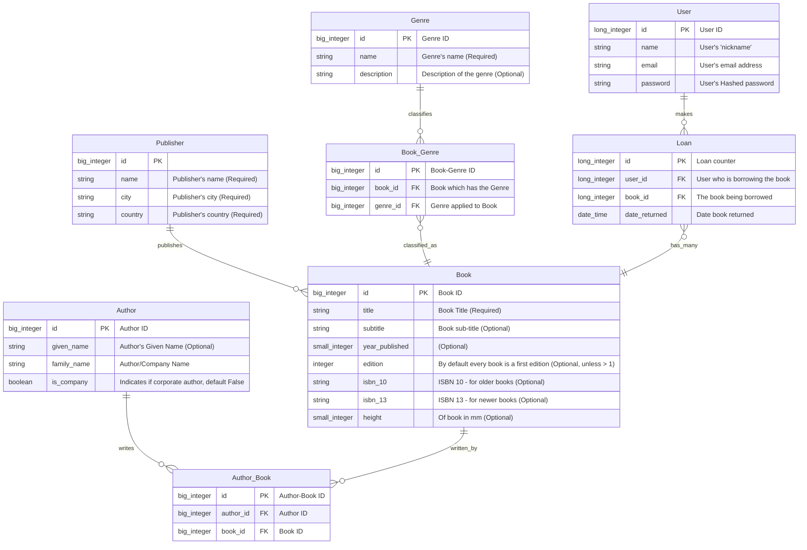

# Library ER Diagram

```mermaid
erDiagram
    Author ||--o{ Author_Book : writes 
    Book ||--o{ Author_Book : written_by
    Publisher ||--o{ Book : publishes
    Genre ||--o{ Book_Genre : classifies
    Book_Genre }o--|| Book : classified_as
    User ||--o{ Loan : makes
    Loan }o--|| Book : has_many
    
    Loan {
        long_integer id PK "Loan counter"
        long_integer user_id FK "User who is borrowing the book"
        long_integer book_id FK "The book being borrowed"
        date_time date_returned "Date book returned"
    }

    User {
        long_integer id PK "User ID"
        string name "User's 'nickname'"
        string email "User's email address"
        string password "User's Hashed password"
    }
    
    Author{
        big_integer id PK "Author ID"
        string given_name "Author's Given Name (Optional)"
        string family_name "Author/Company Name"
        boolean is_company "Indicates if corporate author, default False"
    }
    
    Book{
        big_integer id PK "Book ID"
        string title "Book Title (Required)"
        string subtitle "Book sub-title (Optional)"
        small_integer year_published "(Optional)"
        integer edition "By default every book is a first edition (Optional, unless > 1)"
        string isbn_10 "ISBN 10 - for older books (Optional)"
        string isbn_13 "ISBN 13 - for newer books (Optional)"
        small_integer height "Of book in mm (Optional)"
    }
    
    Publisher {
        big_integer id PK 
        string name "Publisher's name (Required)"
        string city "Publisher's city (Required)"
        string country "Publisher's country (Required)"
    }

    Genre {
        big_integer id PK "Genre ID"
        string name "Genre's name (Required)"
        string description "Description of the genre (Optional)"
    }

    Book_Genre {
        big_integer id PK "Book-Genre ID"
        big_integer book_id FK "Book which has the Genre"
        big_integer genre_id FK "Genre applied to Book"
    }
        
    Author_Book {
        big_integer id PK "Author-Book ID"         
        big_integer author_id FK "Author ID" 
        big_integer book_id FK "Book ID" 
    }
    
```
