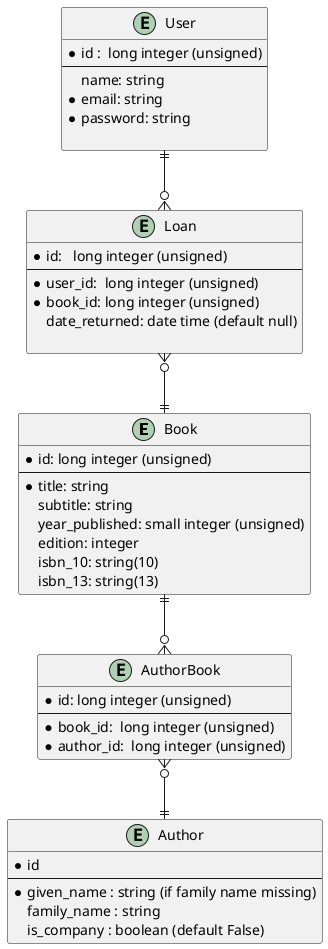

# Library ER Diagram 

```plantuml
@startuml


entity Book {
  * id: long integer (unsigned)
  --
    * title: string
    subtitle: string
    year_published: small integer (unsigned)
    edition: integer
    isbn_10: string(10)
    isbn_13: string(13)
}

entity Author {
  * id
  --
    * given_name : string (if family name missing)
    family_name : string
    is_company : boolean (default False)
}

entity AuthorBook {
  * id: long integer (unsigned)
  --
  * book_id:  long integer (unsigned)
  * author_id:  long integer (unsigned)
}


entity Loan {
    * id:   long integer (unsigned)
    --
    * user_id:  long integer (unsigned)
    * book_id: long integer (unsigned)
    date_returned: date time (default null)
    
}

entity User {
    * id :  long integer (unsigned)
    --
    name: string
    * email: string
    * password: string
    
}


 
Book ||--o{ AuthorBook
AuthorBook }o--|| Author
User ||--o{ Loan
Loan }o--|| Book

@enduml
```
