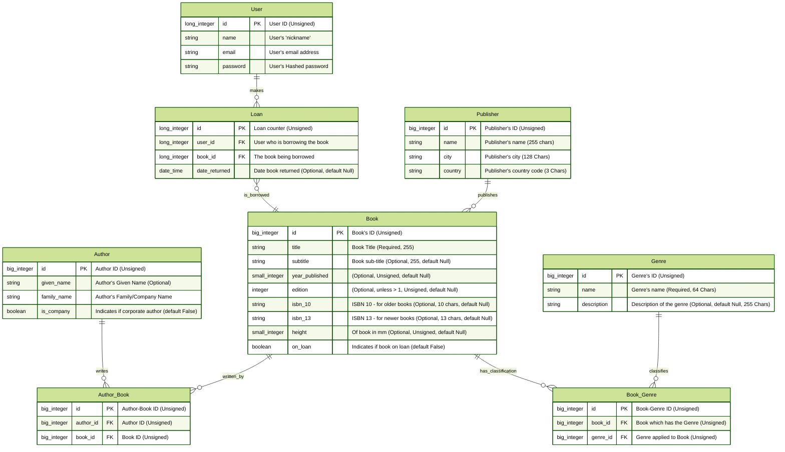

# Library ER Diagram

- All fields are Required unless indicated as Optional.
- Field Sizes are shown in the comments. 

```mermaid
%%{init: {'theme': 'forest'}}%%

erDiagram
    Loan {
        long_integer id PK "Loan counter (Unsigned)"
        long_integer user_id FK "User who is borrowing the book"
        long_integer book_id FK "The book being borrowed"
        date_time date_returned "Date book returned (Optional, default Null)"
    }

    User {
        long_integer id PK "User ID (Unsigned)"
        string name "User's 'nickname'"
        string email "User's email address"
        string password "User's Hashed password"
    }
    
    Author{
        big_integer id PK "Author ID (Unsigned)"
        string given_name "Author's Given Name (Optional)"
        string family_name "Author's Family/Company Name"
        boolean is_company "Indicates if corporate author (default False)"
    }
    
    Book{
        big_integer id PK "Book's ID (Unsigned)"
        string title "Book Title (Required, 255)"
        string subtitle "Book sub-title (Optional, 255, default Null)"
        small_integer year_published "(Optional, Unsigned, default Null)"
        integer edition "(Optional, unless > 1, Unsigned, default Null)"
        string isbn_10 "ISBN 10 - for older books (Optional, 10 chars, default Null)"
        string isbn_13 "ISBN 13 - for newer books (Optional, 13 chars, default Null)"
        small_integer height "Of book in mm (Optional, Unsigned, default Null)"
        boolean on_loan "Indicates if book on loan (default False)"
    }
    
    Publisher {
        big_integer id PK "Publisher's ID (Unsigned)"
        string name "Publisher's name (255 chars)"
        string city "Publisher's city (128 Chars)"
        string country "Publisher's country code (3 Chars)"
    }

    Genre {
        big_integer id PK "Genre's ID (Unsigned)"
        string name "Genre's name (Required, 64 Chars)"
        string description "Description of the genre (Optional, default Null, 255 Chars)"
    }

    Book_Genre {
        big_integer id PK "Book-Genre ID (Unsigned)"
        big_integer book_id FK "Book which has the Genre (Unsigned)"
        big_integer genre_id FK "Genre applied to Book (Unsigned)"
    }
        
    Author_Book {
        big_integer id PK "Author-Book ID (Unsigned)"         
        big_integer author_id FK "Author ID (Unsigned)" 
        big_integer book_id FK "Book ID (Unsigned)" 
    }

    Publisher ||--o{ Book : publishes       
    Book ||--o{ Book_Genre : has_classification
    Book ||--o{ Author_Book : written_by
    Loan }o--|| Book : is_borrowed
    Genre ||--o{ Book_Genre : classifies
    Author ||--o{ Author_Book : writes 
    User ||--o{ Loan : makes
```
