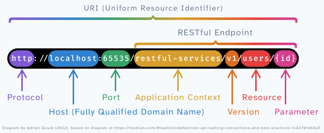
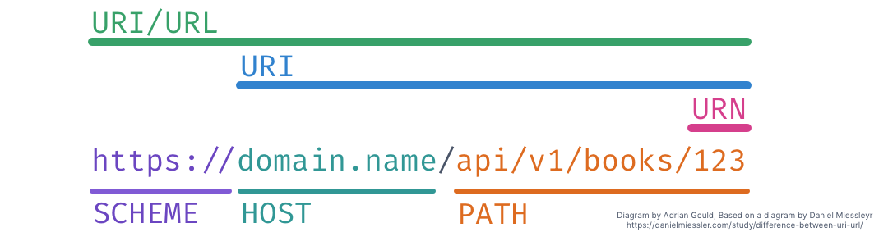

# Making an API 0 - Introduction

This set of tutorials is on how to create an API using
Laravel (v9 or later) and Postman (for testing).

You will also add a plugin to document your API dynamically.

## Tutorial Index

- [Setting Up](ReadMe-00-Setting-Up.md)🔗
- [Postman](ReadMe-02-Postman.md)🔗
- [Introduction](ReadMe-10-API-introduction.md)🔗
- [Index and Show](ReadMe-11-API-index-show.md)🔗
- [Create](ReadMe-13-API-create.md)🔗
- [Update](ReadMe-14-API-update.md)🔗
- [Delete](ReadMe-15-API-delete.md)🔗
- [Documenting API](ReadMe-16-API-documenting.md)🔗
- [Exercises](ReadMe-90-API-exercises.md)🔗
- [Pagination](ReadMe-17-API-pagination.md)🔗
- [API Base Controller](ReadMe-18-API-Base-controller.md)🔗
- [Fallback Route](ReadMe-19-API-fallback-route.md)🔗
- [Authentication](ReadMe-21-API-authentication.md)🔗
---

# Required Resources

We are presuming you are using:

- PC/Mac
    - Docker Desktop
- PC
    - Windows Terminal 
    - Windows Subsystem for Linux v2 (WSL2)
    - Ubuntu Linux on WSL2
- MacOS
    - iTerm 2  

All code will use PHP 8.0 or later. Actual version used in 
the tutorial is 8.1.x.

## Links

Links to useful resources on Docker, Laravel, and so on are available in [ReadMe-99-Links.md](ReadMe-99-Links.md).

# Terminology

Before we start on the process, let's get the obligatory terminology out of the way...

| Term              | Definition                                                                                                         |
|-------------------|--------------------------------------------------------------------------------------------------------------------|
| API               | **A**pplication **P**rogramming **I**nterface.                                                                     |
| Endpoint          | This is the "URI" that is used to make a call to an API.                                                           |
| JSON              | **J**ava**S**cript **O**bject **N**otation. Used by RESTful API structure.                                         |
| Resource          | The item being accessed or used.                                                                                   |
| Resourceful Route | A resourceful route automatically determines controller and method used based on the conventions of the framework. |
| REST              | **Re**presentational **S**tate **T**ransfer.                                                                       |
| RFC               | **R**equest **F**or **C**omment                                                                                    |
| Route             | How an API endpoint request is directed to the relevant controller method.                                         |
| SOAP              | **S**imple **O**bject **A**ccess **P**rotocol.                                                                     |
| URI               | **U**niform **R**esource **I**dentifier.                                                                           |
| URN               | **U**niform **R**esource **N**ame/**N**umber.                                                                      |
| URL               | **U**niform **R**esource **L**ocator.                                                                              |
| XML               | e**X**tensible **M**arkup **L**anguage. Used by the SOAP API structure.                                            |

## REST and JSON

As we are creating a **REST**ful **API**, we will be returning **JSON**
based results to any request, as against a **SOAP** based API which
communicates via **XML**.

## URL/URI Structure 

From Daniel Miessler's article 
"[Difference Between URI and URN](https://danielmiessler.com/study/difference-between-uri-url/)", 
this is a very good summary:

- Many of the old RFCs (eg. RFC 3986) are ancient, poorly written.
- These RFCs are not worth debating until they’re updated.
- They have had supplemental RFCs written to clarify points 
  (eg. RFCs 6874, 7320, 8820)
- A URI is an identifier.
- A URL is an identifier that tells you how to get to it.
- Use the term that is best understood by the recipient.

The diagram below shows the URL, URN and URI components and Scheme, 
Host and Path relationships, and how a full 
scheme-host-path may be called URL or URI. As stated above, use which
is best for the person(s) you are talking to.

Another good article is 
[URI vs URL](https://www.hostinger.com/tutorials/uri-vs-url) 
on the Hostinger website. 

It is recommended that you read these two articles.

# HTTP Response Codes

One part of an API is the response it gives to a request, be that for a
`GET`, `POST`, `DELETE`, `PUT` or `PATCH`.

The commonly used REST specific codes are shown below:

| Code Number | Meaning                | Commonly Used |
| ----------- | ---------------------- |---------------|
| `200`       | Ok                     | Y             |
| `201`       | Created                | Y             |
| `202`       | Accepted               |               |
| `204`       | No content             |               |
| `301`       | Moved Permanently      |               |
| `302`       | Found                  | Y             |
| `303`       | See Other              |               |
| `304`       | Not Modified           | Y             |
| `307`       | Temporary Redirect     |               |
| `400`       | Bad Request            | Y             |
| `401`       | Unauthorised           | Y             |
| `403`       | Forbidden              | Y             |
| `404`       | Not Found              | Y             |
| `405`       | Method Not Allowed     |               |
| `406`       | Not Acceptable         |               |
| `412`       | Precondition Failed    |               |
| `415`       | Unsupported Media Type |               |
| `500`       | Internal Server Error  |               |
| `501`       | Not Implemented        |               |

The "Use?" column is an indication of commonly used codes.

More details may be found at:

- [REST API Tutorial - HTTP Status Codes](https://restfulapi.net/http-status-codes/).

# What's next?

Next it's onto [Retrieve - aka Index/Show](ReadMe-11-API-index-show.md).
