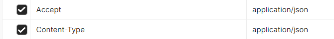
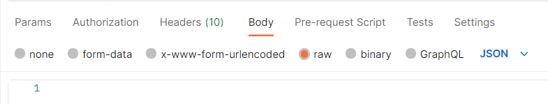
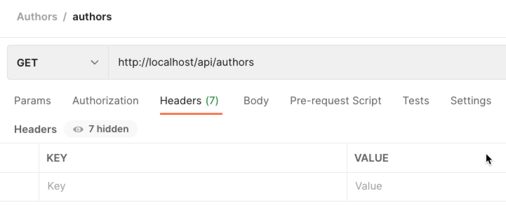
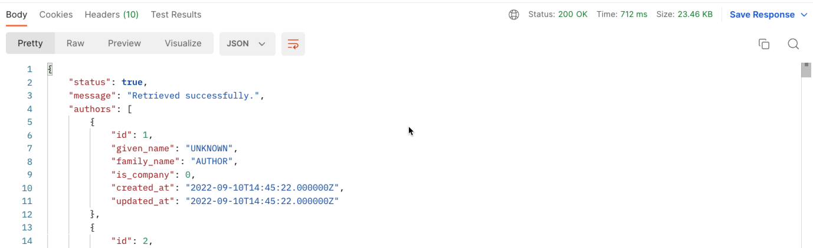
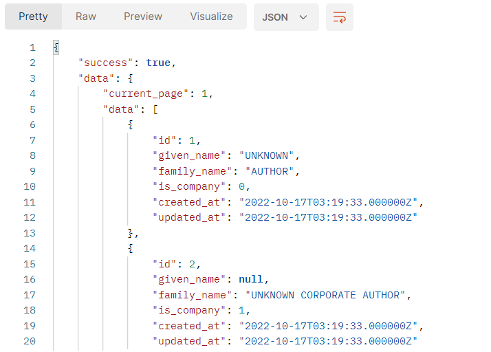
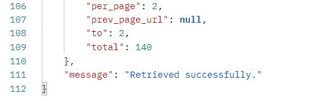
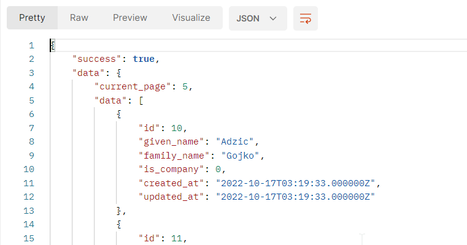

# Making an API 1 - Reading Data

This is Part 1 - the Index and Show methods. 

> #### Important:
> Before continuing, you should have completed at least one of the 
> suggested Postman learning video series from: 
> - [ReadMe-API-0-introduction.md](ReadMe-10-API-introduction.md)🔗 


## Tutorial Index

- [Setting Up](ReadMe-00-Setting-Up.md)🔗
- [Postman](ReadMe-02-Postman.md)🔗
- [Introduction](ReadMe-10-API-introduction.md)🔗
- [Index and Show](ReadMe-11-API-index-show.md)🔗
- [Create](ReadMe-12-API-create.md)🔗
- [Update](ReadMe-13-API-update.md)🔗
- [Delete](ReadMe-14-API-delete.md)🔗
- [Documenting API](ReadMe-15-API-documenting.md)🔗
- [Exercises](ReadMe-90-API-exercises.md)🔗
- [Pagination](ReadMe-16-API-pagination.md)🔗
- [API Base Controller](ReadMe-17-API-Base-controller.md)🔗
- [Fallback Route](ReadMe-18-API-fallback-route.md)🔗
- [Authentication](ReadMe-20-API-authentication.md)🔗
---

# Author API

Before we get into the API creation, we need to create the API routing, 
the controller and some other required components.


We start with the Author API as we can test what it does easily without 
referring to the books.

## API Routes

Open the `routes/api.php` file and add the following:

```php
Route::apiResource('authors', \App\Http\Controllers\API\AuthorAPIController::class);
```

You can also use the following:
```php
Route::apiResource('authors', AuthorAPIController::class);
```
Remember then to include the class with the other "imports":
```php
use App\Http\Controllers\API\AuthorAPIController;
use Illuminate\Http\Request;
use Illuminate\Support\Facades\Route;
```

## Automatic API...

The router will automatically filter the request for the `api` when you 
send it to the URL containing `api` immediately after the domain name:
`http://DOMAIN.NAME/api`

This means that to make a 'call' to the API for the authors, you will 
now prepend `authors` with `/api/` like this: `http://DOMAIN.NAME/api/authors`.

> Remember that `DOMAIN.NAME` in the development environment is going to
> be `localhost`.

# Author API Controller

Create the API controller for the Author:
```shell
sail artisan make:controller API/AuthorAPIController --api --resource
```
This creates a new Controller in the `app/Http/Controllers/API` folder. 
The API folder was created automatically by `artisan`.

Because we selected the `--api` and `--resource` options we got a
"resourceful controller" that removed the front end specific methods. We
only have _five_ to deal with:

```php
    public function index(){}
    public function store(Request $request){}
    public function show($id){}
    public function update(Request $request, $id){}
    public function destroy($id){}
```

## Index API Method

Let's start by creating the required API call for the 
`http://DOMAIN/api/authors` endpoint, which will give a list of authors.

At the moment we are **not** paginating the results, so the list will 
be all the authors we have. Obviously this is not the best idea, 
especially if the list is over 100 authors, as the amount of data that
is transmitted will be very large.

| Request                     | Response                                      |
|-----------------------------|-----------------------------------------------|
| `http://DOMAIN/api/authors` | JSON list of Authors and request result code  |

Edit the `AuthorAPIController` and add the following to the `index` method:

```php
$authors = Author::all();
return response()->json(
    [
        'status' => true,
        'message' => "Retrieved successfully.",
        'data' => [
            'authors' => $authors,
        ],    
    ],
    200
);
```

- Get all the authors
- Return a JSON response with:
  - A `message` - something to send to the caller that may 
  be displayed as a message to the user
  - The list of authors (in the `data` section)
  - Response code of `200`, OK.

## Show API Method

Our next call is for the `api/authors/{author}` endpoint. This is the one we retrieve 
a single author.

| Request                              | Response                                             |
|--------------------------------------|------------------------------------------------------|
| `http://DOMAIN/api/authors/{author}` | JSON for the single Author and request result code  |

Edit the `AuthorAPIController` and add the following to the `show` method:

```php
$author = Author::query()
    ->where('id', $id)
    ->get();

$response = response()->json(
    [
        'status' => false,
        'message' => "Author Not Found",
        'data' => [
            'authors' => null,
        ],
    ],
    404  # Not Found
);

if ($author->count() > 0) {
    $response = response()->json(
        [
            'status' => true,
            'message' => "Retrieved successfully.",
            'data' => [
                'authors' => $author,
            ],
        ],
        200  # Ok
    );
}
return $response;
```

We `query()` the `Author` model, asking to retrieve the author
`where` the `id` is the one passed in the URL.

Next we set up a default response, this being a 404 ("not found") 
response, with a null for the author and a suitable error message.

Then we check to see if the number of authors found was at least
1 (it should only give 1 or 0), if it was then the response will be 
200 ("Ok") and the author that was found.

A review of HTTP response codes may be found in:

- [ReadMe-API-0-introduction.md](ReadMe-10-API-introduction.md)🔗

## Quick "Brute Force" Test 

> This testing should not be used under normal circumstances as it
> will only work for the index and show methods.

A quick test of the API so far may be done using a browser window and 
going to `http://localhost/api/authors` which will show a 
JSON structure with all the authors.

## Postman Test: Important Notes on Headers

Postman is a wonderful way of testing your APIs, but we need to take care when sending data to and getting data back from 
the application.

There are a few things we MUST do to make sure we are sending and receiving JSON data only.

### Headers

In the Headers of the Postman request we must do two things:
1. Add `Content-Type` with a setting of `application/json`.
2. Add `Accept` with the same setting of `application/json`.

Note that you are not able to edit the existing `accept` and this new line will override the existing one.



### Body

It is advised (or is that required) to use the Body in RAW mode with a type of JSON.




## Postman Test: Browse

The Postman configuration for the Browse/Index/Retrieve is:



Make sure you modify both of `accept` and `content-type` entries.

## Postman Test: Read

When you send the GET request you will obtain results similar to:




Make sure you modify both of `accept` and `content-type` entries.


## Postman Test: Index/Get with Page number and Resources per page

What if you want to retrieve a certain page of results or change the number of items retrieved?

This is done by passing the requested details as JSON:

```json
{
    "page":1,
    "per_page":2
}
```

When you send the request you will get the results expected.






Try changing the page to be 5 and see the results...





# What's next?

Next it's onto [Create](ReadMe-12-API-create.md).

Before that though, remember to [complete the exercises](ReadMe-90-API-exercises.md).
