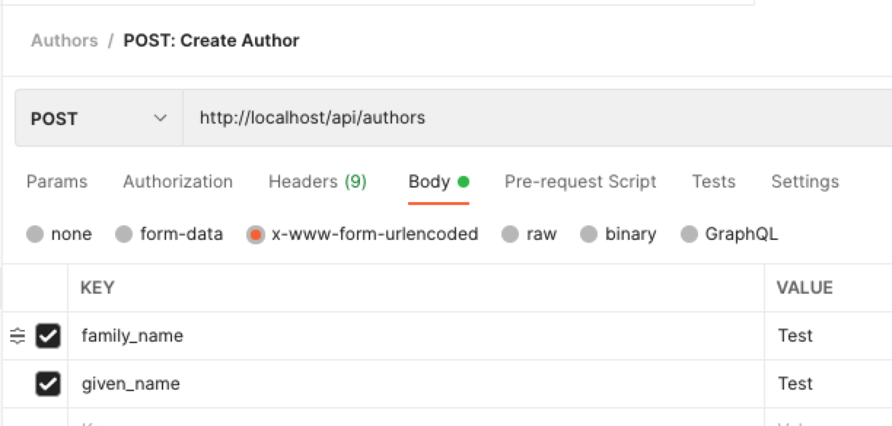
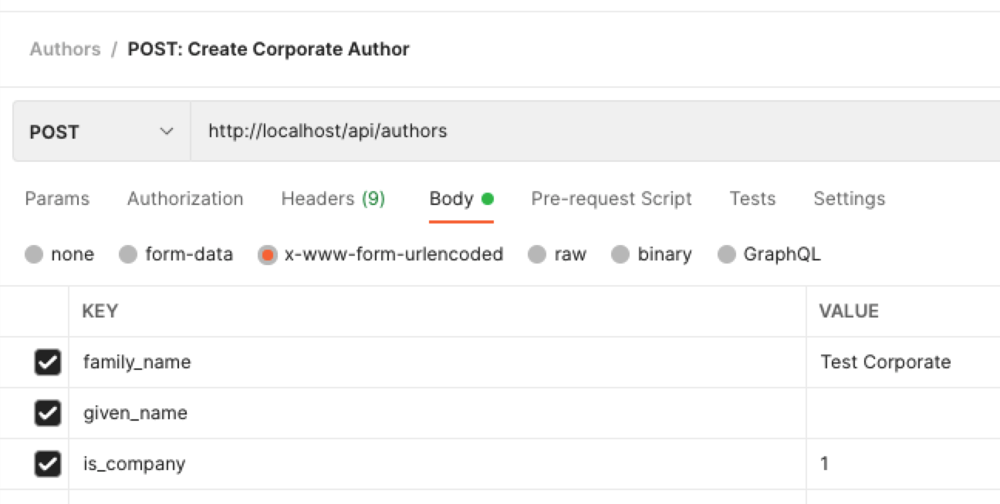
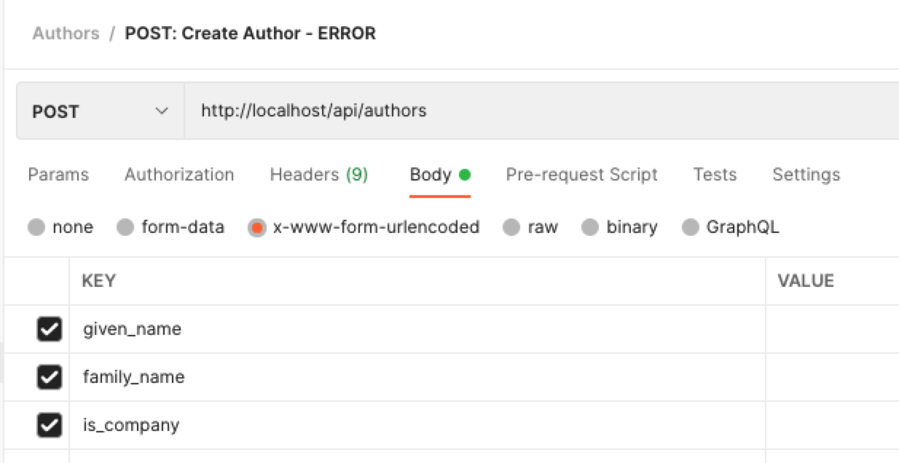
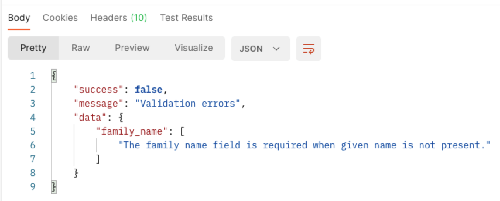

# Making an API II - Inserting Data

In [API part I](ReadMe-11-API-index-show.md) we looked at how to query the data via
an API in the Index and Show methods.

The Index is NOT paginated (a problem for a later step), so we retrieve
ALL the records (even if we had 1,000,000 of them)!

## Tutorial Index

- [Introduction](ReadMe-10-API-introduction.md)  🔗
- [Index and Show](ReadMe-11-API-index-show.md)  🔗
- [Create](ReadMe-12-API-create.md)  🔗
- [Update](ReadMe-13-API-update.md)  🔗
- [Delete](ReadMe-14-API-delete.md)  🔗
- [Documenting API](ReadMe-15-API-documenting.md)  🔗
- [Exercises](ReadMe-90-API-exercises.md)  🔗
- [Pagination](ReadMe-16-API-pagination.md)  🔗
- [Authentication](ReadMe-20-API-authentication.md)  🔗

---

# Author API - Create a New Author

As we have employed Resourceful Routing, we do not need to create a
specific route. :smile:

Our exising `routes/api.php` file has this:

```php
Route::resource('authors', \App\Http\Controllers\API\AuthorAPIController::class);
```

You can also use the following:

```php
Route::resource('authors', AuthorAPIController::class);
```

This means we can now concentrate on the `API/AuthorAPIController.php` 
file and the `store`method.

## Store API Method

Let's start by creating the required API call for the
`http://DOMAIN/api/authors` endpoint.

| Request                   | HTTP Verb | Response                                               |
| ------------------------- |:---------:|--------------------------------------------------------|
| http://DOMAIN/api/authors |   POST    | request result code (201), message and author as JSON  |

We want our method to do the following:

- Validate the author data
- Store the new author
- Return a JSON response with:
    - A message - something to send to the caller that may be displayed as
      a message to the user
    - The list of authors
    - Response code of `201, Created`

### Validate Submitted Data

To perform validation in the best way we need to make use of a Store Request.
The Requests are kept in the `app/Http/Requests` folder.

To create the Request Stub we use the command:

```shell
sail artisan make:request StoreAuthorAPIRequest
```

We now edit the `StoreAuthorAPIRequest.php` file and make the following
modifications...

At the top of the file, add the two extra lines to import HTTP Response
Exceptions and the Validator contract:

```php
use Illuminate\Foundation\Http\FormRequest;
use Illuminate\Http\Exceptions\HttpResponseException;
use Illuminate\Contracts\Validation\Validator;
```


### Allowing the Request

We are currently not checking to see if the user is logged in so change
the `authorized` method to return `true`.

```php
public function authorize()
{
    return true;
}
```

### Validation Rules

Now we need to create the rules for the validation method:

| Field        | Rules                                      |
|--------------|--------------------------------------------|
| Given Name   | max 64 chars                               |
| Family Name  | required without given name, max 128 chars |

To define a maximum length we use `max:LENGTH`.

To define something as required when another field is missing, we use:
`required_without:FIELD_NAME`.

Replace LENGTH with a number, and FIELD_NAME with the field that may be blank.

```php
return [
    'given_name' => [
        'max:64',
    ],
    'family_name' => [
        'required_without:given_name',
        'max:128',
    ],
    'is_company' => [
        'boolean',
    ]
];
```

#### Response Structure

Responses should have a common structure, be they successful or not.

A reasonable structure could be:

```json
{
    "success": true,
    "message": "MESSAGE TEXT",
    "data": [ { } ]
}
```

- `success` will be a yes or no (aka true and false) situation. So
  we return true or false.
- `message` will be some text to give immediate feedback to the caller. 
  This could be further presented to the end user if appropriate.
- `data` will contain an array of any returned data, be that data 
  from queries or error messages, or similar.

### Failed Validation Response

Because we want to send back a JSON response it is a good idea to 
structure our response to failed validation in a manner that is usable.

We do this by adding the `failedValidation` method.

```php
public function failedValidation(Validator $validator)
{
    throw new HttpResponseException(response()->json([
        'success' => false,
        'message' => 'Validation errors',
        'data' => $validator->errors()
    ]));
}
```

### Response Messages

To customise the response messages from the validator we add a `messages` method:

```php
public function messages()
{
    return [
        'family_name.required_without' => 'A family name is required. This is also used for Corporate authors',
        'is_company' => 'Company must be set to True or False',
    ];
}
```

## AuthorAPIController updates

Now we have the Response set up we modify the `AuthorAPIController` a little.

Edit the `AuthorAPIController` and change the store signature to:


```php
public function store(StoreAuthorAPIRequest $request)
```

Next we can add the author to the database.

Edit the `AuthorAPIController` and add the following to the store method:

```php
$validated = $request->validated();                       // Get validated data
$validated['is_company'] = $validated['is_company'] ?? 0; // Default to false
$author = Author::create($validated);                     // Create the author

return response()->json(
    [
        'success' => true,
        'message' => "Created successfully.",
        'data' => [
            'authors' => $author,
        ],
    ],
    200
);
```

## Testing with Postman

Because we are sending data to the API we cannot use the brute force
check via the browser.

We need to use Postman to do the testing. In this test we are not using
authenticated access. 

A suitable postman request could be as shown below:



The second image shows a corporate author being added:



The resulting response from the request is:


If an incorrect request is made, for instance no values are sent then
we get suitable errors.

Requests with missing data:




Responses with errors:



## What about blank family names?

One nice extension to the API could be to make sure that single name
entries have the same location for the data.

For example: if the given name is provided, but the family name is
missing, then the given name could be moved into the family name.

Alternatively we move the family name into the given name.

Either is workable and equally useful.

Here is the code to move the given name into the family name if 
the family name is missing but a given name is provided:

```php
if (!isset($validated['family_name']) ) {
    // This will only work if the migration for the author has
    // one of these two options:
    // - the family_name's length is greater than the given_name length
    // - the family_name's length is the same as the given_name's length
    // if not you will need to shorten the given_name.
    $validated['family_name'] = $validated['given_name'];
    $validated['given_name'] = null;
}
```

The alternative however, family name into given name, **is not valid in our case**. This is because we set our max length for given_name to 64 and our family_name to 128 characters, meaning we will break our own rules if the family_name is longer than 64 characters and gets swapped.

The above code will need to appear immediately before the store method's line:

```php
$author = Author::create($validated);
```


# What's next?

Next it's onto [Update](ReadMe-13-API-update.md).

Before that though, remember to 
[complete the exercises](ReadMe-90-API-exercises.md).
