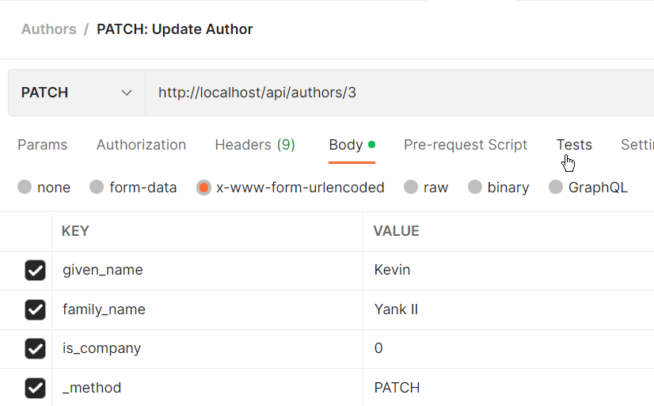

# Making an API III - Updating Data

So far we have browsed (index), read (show) and added (create) authors. 
Now we need to look at updating them.


## Tutorial Index

- [Introduction](ReadMe-10-API-introduction.md)  🔗
- [Index and Show](ReadMe-11-API-index-show.md)  🔗
- [Create](ReadMe-12-API-create.md)  🔗
- [Update](ReadMe-13-API-update.md)  🔗
- [Delete](ReadMe-14-API-delete.md)  🔗
- [Documenting API](ReadMe-15-API-documenting.md)  🔗
- [Exercises](ReadMe-90-API-exercises.md)  🔗
- [Pagination](ReadMe-16-API-pagination.md)  🔗
- [Authentication](ReadMe-20-API-authentication.md)  🔗

---

# Author API - Update an Author

Updating an author is very similar to creating an author. The main
steps in the process are:

- retrieve author 
- patch the author data
- save the changes
- report back updated author and success

There are other parts we have not included, such as validation of data,
but will implement them as we get to the relevant point.

# Update Author API Request

Let's start with the `UpdateAuthorAPIRequest` as it is very similar to the Store version.

To create the request stub we use the command:

```shell
sail artisan make:request UpdateAuthorAPIRequest
```

The code for the Update request is identical (for the time
being) to the Store.

Copy the code over from one to the other, as needed.

## Update Method

Next we can hit the update method in the AuthorAPIController.

This method will do the following:

- validate data being used for update
- attempt to retrieve the author
- set up default response JSON
- if the author exists, then:
  - update the changed parts of the author
  - save the changes
  - update the response JSON
- send the response

### Validate the Data

Using a request, `UpdateAuthorAPIRequest` allows us to separate the
validation from the controller method, thus shortening it. It also
provides us with a method of returning a custom response, as per the
'create' method.

Start by updating the `authorize` method. This is so we can test 
without authentication:
```php
return true;
```

Next add the `rules()` to validate the data being passed:

```php
return [
    'given_name' => [
        'max:64',
    ],
    'family_name' => [
        'required_without:given_name',
        'max:128',
    ],
    'is_company' => [
        'boolean',
    ]
];
```

Finally the custom responses, `failedValidation`, for validation 
failures, and the `messages` that are sent to the caller:

#### Failed Validation
```php
throw new HttpResponseException(
    response()->json([
        'success' => false,
        'message' => 'Validation errors',
        'data' => $validator->errors(),
    ])
);
```

#### Messages
```php
return [
    'family_name.required_without' =>
           'Either a given or family name is required.',
    'is_company' => 
           'Company must be set to True or False',
];
```

### Retrieve Author

There are two ways to retrieve the author.

- Use the Author's ID and do a Find
- Use resourceful routing to perform the find for us

We will use the Author ID and perform the query ourselves.

First we add the relevant imports to the top of `AuthorAPIController.php`:

```php
use App\Http\Controllers\Controller;
use App\Http\Requests\StoreAuthorAPIRequest;
use App\Http\Requests\UpdateAuthorAPIRequest;
use App\Models\Author;
use Illuminate\Http\Request;
use Illuminate\Support\Carbon;
```

And update the update method's request type from `Request` to our newly created `UpdateAuthorAPIRequest`:

```php
public function update(UpdateAuthorAPIRequest $request, $id) {
```

Then inside the update method we can begin by validating, then we can retrieve:

```php
$validated = $request->validated();
$author = Author::query()->where('id', $id)->first();        
```

### Default Response

Adding a default response means we are able to not use an else,
and shorten the code a little:
```php
$response = response()->json(
    [
        'status' => false,
        'message' => "Unable to update: Author Not Found",
        'authors' => null
    ],
    404  # Not Found
);
```

### If author exists...

When we find the author, we can update them. By using a default 
message, if the author is not found we simply bypass this step:

Verifying we found the author:
```php
if (!is_null($author) && $author->count() > 0) {
```

Performing the update:
```php
$validated['is_company'] = $validated['is_company'] ?? 0;
if (!isset($validated['given_name'])) {
    $validated['given_name'] = $validated['family_name'];
    $validated['family_name'] = null;
}

$author['given_name'] = $validated['given_name'];
$author['family_name'] = $validated['family_name'];
$author['is_company'] = $validated['is_company'];
$author['updated_at'] = Carbon::now();
$author->save();
```

Setting up the response because we performed the update:

```php
    $response = response()->json(
        [
            'status' => true,
            'message' => "Updated successfully.",
            'authors' => $author
        ],
        200  # Ok
    );
}
```
### Send response

And finally sending the response:

```php
return $response;
```

## Testing with Postman

Testing the update requires a little more work. We need to set the 
HTTP method to PATCH, plus we also, due to some browsers/web server
not recognising all HTTP verbs, use the laravel "`_method`" key 
in the body data.

This allows the 'faking' of the PATCH for those systems that do not
recognise the verb.



When you send the test, it should come back with a success (200), 
a message, and data containing the updated author. 


If an incorrect author ID is given then the update will fail. For example, we give the ID of 999 in the following configuration.


Sending this request gives the "failed" message, a 404 (not found) 
error, and the relevant status (false) and author (null).


# What's next?

That's the update completed.

Next it's onto [Delete](ReadMe-14-API-delete.md).

Before that though, remember to [complete the exercises](ReadMe-90-API-exercises.md).


