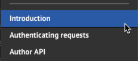
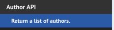
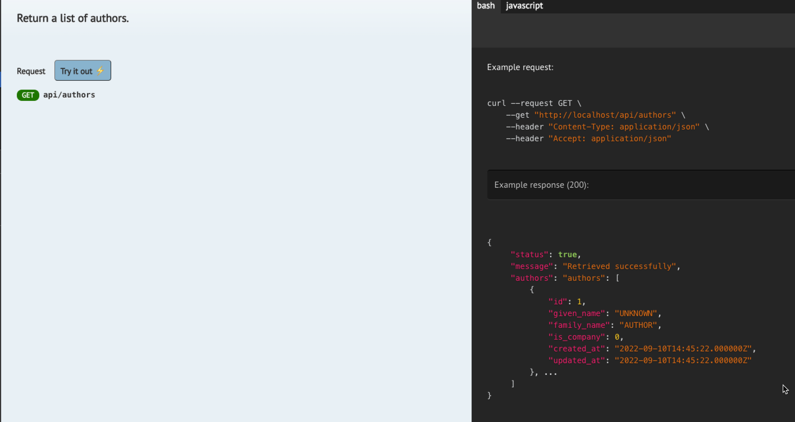

# Documenting the API

There are many ways of documenting your API. 

You may do the documentation using any of the following, each will have pros and cons, but in the end the choice is up to 
you, the developer, and, if the API is to be public, the marketing/UX developers.

- [Postman]()
- [Scribe](https://scribe.knuckles.wtf/laravel) - a composer package
- [RapidAPI]()
and more


## Tutorial Index

- [Introduction](ReadMe-10-API-introduction.md)  🔗
- [Index and Show](ReadMe-11-API-index-show.md)  🔗
- [Create](ReadMe-12-API-create.md)  🔗
- [Update](ReadMe-13-API-update.md)  🔗
- [Delete](ReadMe-14-API-delete.md)  🔗
- [Documenting API](ReadMe-15-API-documenting.md)  🔗
- [Exercises](ReadMe-90-API-exercises.md)  🔗
- [Pagination](ReadMe-16-API-pagination.md)  🔗
- [Authentication](ReadMe-20-API-authentication.md)  🔗


## Scribe

To install and use Scribe, follow these steps: 

Install the package:
```shell
sail composer require --dev knuckleswtf/scribe
```
Publish the vendor specific configuration and other files:
```sail
php artisan vendor:publish --provider="Knuckles\Scribe\ScribeServiceProvider" --tag=scribe-config
```
This will create a config file for Scribe that we can potentially use to customise its behaviour.

### Version 4 
Now, one ting to check before continuing is, has Scribe v4 been installed or v3?

Open the `composer.json` file in your root directory.

locate the line that starts with `` and if it says something line `^3.xx.x` or such, then replace with `^4.0.0`...

Now run:
```shell
sail composer update
sail artisan scribe:ugrade
sail artisan vendor:publish --tag=scribe-views --tag=scribe-themes --tag=scribe-examples
```

When we did the upgrade and then update it also did bug-fix updates to 20+ packages, plus installed some polyfills and also 
symfony's uid 
package.

Next you will need to edit the `config\scribe.php` file and manually add the missing lines from this code (indicated by a + 
sign):
```php
'strategies' => [
    'metadata' => [
        Strategies\Metadata\GetFromDocBlocks::class,
+       Strategies\Metadata\GetFromMetadataAttributes::class,
    ],
    'urlParameters' => [
        Strategies\UrlParameters\GetFromLaravelAPI::class,
        Strategies\UrlParameters\GetFromLumenAPI::class,
+       Strategies\UrlParameters\GetFromUrlParamAttribute::class,
        Strategies\UrlParameters\GetFromUrlParamTag::class,
    ],
    'queryParameters' => [
        Strategies\QueryParameters\GetFromFormRequest::class,
        Strategies\QueryParameters\GetFromInlineValidator::class,
+       Strategies\QueryParameters\GetFromQueryParamAttribute::class,
        Strategies\QueryParameters\GetFromQueryParamTag::class,
    ],
    'headers' => [
        Strategies\Headers\GetFromRouteRules::class,
+       Strategies\Headers\GetFromHeaderAttribute::class,
        Strategies\Headers\GetFromHeaderTag::class,
    ],
    'bodyParameters' => [
        Strategies\BodyParameters\GetFromFormRequest::class,
        Strategies\BodyParameters\GetFromInlineValidator::class,
+       Strategies\BodyParameters\GetFromBodyParamAttribute::class,
        Strategies\BodyParameters\GetFromBodyParamTag::class,
    ],
    'responses' => [
+       Strategies\Responses\UseResponseAttributes::class,
        Strategies\Responses\UseTransformerTags::class,
        Strategies\Responses\UseApiResourceTags::class,
        Strategies\Responses\UseResponseTag::class,
        Strategies\Responses\UseResponseFileTag::class,
        Strategies\Responses\ResponseCalls::class,
    ],
    'responseFields' => [
+       Strategies\ResponseFields\GetFromResponseFieldAttribute::class,
        Strategies\ResponseFields\GetFromResponseFieldTag::class,
    ],
],
```


## Creating Basic Documentation

Generate the basic documentation:
```shell
sail artisan scribe:generate
```

Test the publication worked by visiting: `http://localhost/docs`

### Making the Documentation Better

The basic docs do not give much information, and a well documented API is very important.

Let's add some extra information and grouping of our API details. Here

Open the `app/Http/Controllers/API/AuthorController.php` and go to the top of the class...

Add the following:

```php
/**
 * @group Author API
 *
 * API endpoints for managing authors
 */
```
Running scribe's artisan command to update the documentation:


This will be then rendered by the Scribe generation as:


So we now have a heading tht is more meaningful. Let's start by adding more meaningful documentation to the methods.

Above the index method we will add documentation that explains how to use the API call and what it returns.

One of the biggest issues with Scribe is that if it does not get examples it will deduct the interface and then also use 
whatever it gets back from a sample call... resulting in index methods giving tens, hundreds or millions of records!

Let's make this more concise and explicit. 

- `@bodyParams` define any parameters that have to be submitted as part of the API call
- `@response` indicates a sample response from the api call.

```php
   /**
     * Return a list of all authors
     *
     * @bodyParams
     *
     * @response {
     *      "status": true,
     *      "message": "Retrieved successfully",
     *      "authors": "authors": [
     *          {
     *              "id": 1,
     *              "given_name": "UNKNOWN",
     *              "family_name": "AUTHOR",
     *              "is_company": 0,
     *              "created_at": "2022-09-10T14:45:22.000000Z",
     *              "updated_at": "2022-09-10T14:45:22.000000Z"
     *          }, ...
     *      ]
     * }
     *
     * @return JsonResponse
     */
    public function index(): JsonResponse
```

After re-generating the documentation the Author API section, when clicked, will reveal our new heading and documentation.



The new "custom" documentation.



## More detail - parameters

When you want to specify a parameter it is a good idea to provide all the details you are able to.

The details should include the type, if it is required, what it represents and an example of it.

There are different parameters including:

- `@urlParam`
- `@bodyParam`

Here is the documentation for the show method, updated to suit Scribe.

```php
 /**
     * Return a single author
     *
     * @param int $id
     * @urlParam    id    integer  required    The id of the author.      Example: 7
 * 
     * @return JsonResponse
     * @response {
     *      "status": true,
     *      "message": "Retrieved successfully.",
     *      "authors": [
     *          {
     *              "id": 7,
     *              "given_name": "Kevin",
     *              "family_name": "Potts",
     *              "is_company": 0,
     *              "created_at": "2022-09-10T14:45:22.000000Z",
     *              "updated_at": "2022-09-10T14:45:22.000000Z"
     *          }
     *      ]
     * }
     */
```

## Alternative markup
Another form of markup is to yse 

---


# What's next?

Next it's onto [Pagination](ReadMe-16-API-pagination.md).

Before that though, remember to [complete the exercises](ReadMe-90-API-exercises.md).
