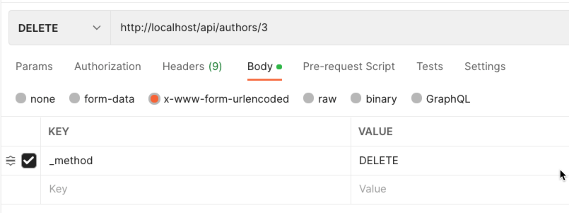
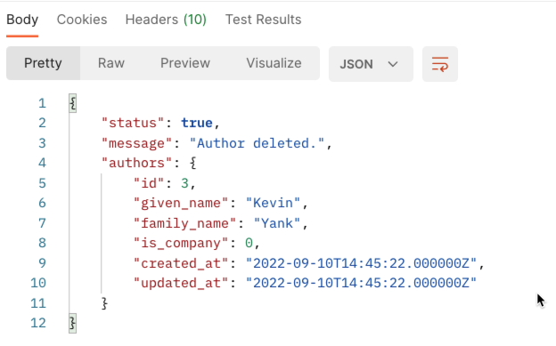

# Making an API IV - Deleting Data

So far we have browsed (index), read (show), added (create), and edited (update) authors. 

Now we need to look at deleting them.


## Tutorial Index

|             Previous              |                Index                 |                      Next                       |
|:---------------------------------:|:------------------------------------:|:-----------------------------------------------:|
| [Update](ReadMe-15-API-update.md) | [Tutorial Index](ReadMe-00-Index.md) | [Documentation](ReadMe-16-API-documentation.md) | 

## Author API - Delete an Author

Deleting an author is very similar to updating an author. The main
steps in the process are:

- retrieve author 
- destroy the author
- report back deleted author and success

Let's put this together.

## Retrieve the author

Attempt to retrieve the author.

```php
$author = Author::query()->where('id', $id)->first();
```

## Keep a copy of the author (or Null)

It could be useful to send a copy of the author that is being removed
back to the API caller.

In this case the `destroyedAuthor` may be Null if the ID was not valid.

```php
$destroyedAuthor = $author;
```
## Construct Response for 'No author' found

As per the Create and Update methods, we construct a default response.

```php
$response = response()->json(
    [
        'status' => false,
        'message' => "Unable to delete: Author Not Found",
        'authors' => null
    ],
    404  # Not Found
);
```
## Destroy the Retrieved Author

If we have found the author we are wanting to remove, so we now need 
to delete it from the database.

```php
if (!is_null($author) && $author->count() > 0) {
    $author->delete();
```
## Create Response 

As we have now destroyed (deleted) the author, we create the
response we are going to send back.

```php
    $response = response()->json(
        [
            'status' => true,
            'message' => "Author deleted.",
            'authors' => $destroyedAuthor
        ],
        200  # Ok
    );
}
```

## Return the success, message and author removed

Final step is to return the response back to the API caller.

```php
return $response;
```

## Testing with Postman

To delete an author with Postman we use a similar set up to the Create
and the Update, except the HTTP verb is `DELETE`.

We set the VERB to `DELETE` and set the `_method` to `DELETE`.

The ID of the author to be deleted is part of the URL.



When you submit the request, the response should be 200 (OK) and the
data of the author that was just removed.



# What's next?

Next it's onto [Pagination](ReadMe-18-API-pagination.md).

Before that though, remember to [complete the exercises](ReadMe-90-API-exercises.md).
