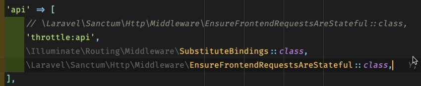

# Making an API - Authorisation

TODO: Write this section


## Tutorial Index
- [Setting Up](ReadMe-00-Setting-Up.md) 🔗
- [Introduction](ReadMe-10-API-introduction.md) 🔗
- [Index and Show](ReadMe-11-API-index-show.md) 🔗
- [Create](ReadMe-12-API-create.md) 🔗
- [Update](ReadMe-13-API-update.md) 🔗
- [Delete](ReadMe-14-API-delete.md) 🔗
- [Documenting API](ReadMe-15-API-documenting.md) 🔗
- [Pagination](ReadMe-16-API-pagination.md) 🔗
- [Authentication](ReadMe-20-API-authentication.md) 🔗
- [Authorisation](ReadMe-21-API-authorisation.md) 🔗
- [Exercises](ReadMe-90-API-exercises.md) 🔗
- [Useful Links](ReadMe-99-Links.md) 🔗
---
TODO: Finish this section

---

## Install Laravel Sanctum

Use the command:
```shell
sail composer require laravel/sanctum
```
to install Sanctum.

Then publish the sanctum provider and migrate the tables as required.

```shell
sail artisan vendor:publish --provider="Laravel\Sanctum\SanctumServiceProvider"
sail artisan migrate
```

Add the following line to the `app/Http/Kernel.php` file at the end of the `api` section:

```php
\Laravel\Sanctum\Http\Middleware\EnsureFrontendRequestsAreStateful::class,
```



## Create the API Authentication Controller

Run the following aretisan command to create a new controller `AuthAPIController` in the API folder:

```shell
sail artisan make:controller API/AuthAPIController
```

Open this controller and add the following register and login methods to the class:

```php
public function register(Request $request){

    $post_data = $request->validate([
            'name'=>'required|string',
            'email'=>'required|string|email|unique:users',
            'password'=>'required|min:8'
    ]);
    
    $user = User::create([
        'name' => $post_data['name'],
        'email' => $post_data['email'],
        'password' => Hash::make($post_data['password']),
    ]);
    
    $token = $user->createToken('authToken')->plainTextToken;
    
    return response()->json([
        'access_token' => $token,
        'token_type' => 'Bearer',
    ]);
}
    
public function login(Request $request){
    if (!\Auth::attempt($request->only('email', 'password'))) {
           return response()
                ->json([
                    'message' => 'Login information is invalid.'
                ], 401);
    }
    
    $user = User::where('email', $request['email'])->firstOrFail();
    $token = $user->createToken('authToken')->plainTextToken;
    
    return response()->json([
        'access_token' => $token,
        'token_type' => 'Bearer',
    ]);
}
```
## Create the Register and Login Requests

Using the CLI again, run these two commands to create the Login ad
## Add the Routes to the API

Open the `routes/api.php` file and add two routes for the regiatration and authentication:

```php
Route::post('register',[AuthController::class,'register']);
Route::post('login', [AuthController::class, 'login']);
```

These will both be accessed via the `api` based URL.

```text
http://localhost/api/register
http://localhost/api/login
```

## Create Postman Tests

We need two tests, one to check a user can be registered and the other to cehck the login.

### Registering, Missing Data


### Registering, Invalid eMail


### Registering, All Valid


### Login, Incorrect Details


### Login, Correct Details

