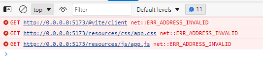

# Making a Web Application - Home Page

In this set of tutorials we create a web interface to act as a back-end management system.

The interface will use Blade and TailwindCSS in this initial configuration.


## Tutorial Index
|               Previous               |                Index                 |                           Next                           |
|:------------------------------------:|:------------------------------------:|:--------------------------------------------------------:|
| [Tutorial Index](ReadMe-00-Index.md) | [Tutorial Index](ReadMe-00-Index.md) | [54 Authors: Browse](ReadMe-54-Blade-Authors-Browse.md)  |

## Static Page Controller

Before we start doing any work with Blade, we are going to create a static page controller.

This controller will then let us show pages such as the 'home', 'contact', 'about' and others as needed.


Create the new controller using:

```shell
sail artisan make:controller StaticPageController
```
Open the app/Http/Controllers/StaticPageController.php file.

In this file we will now create a series of methods for the various static pages.

### Home Page

Add the home method:

```php
    /**
     * Show the Home (index) page.
     *
     * @return \Illuminate\Http\Response
     */
    public function home()
    {
        return view('static.home');

    }
```
## Templates and Blade

Next we need to make sure we have a suitable 'template' for these static pages.

Templates act as  away to reduce code duplication (aka DRY out our code).

The templates are stored in the `/resources/views/layouts` folder.

We will use the guest layout as the base.

Open the `guest.blade.php` file.

We are going to re-write it.

### HEAD section of page

At the top of this file we have the "HEAD" that provides the metadata and various links to load the page resources.

Modify this section to read:

```php
<!DOCTYPE html>
<html lang="{{ str_replace('_', '-', app()->getLocale()) }}">
    <head>
        <meta charset="utf-8">
        <meta name="viewport" content="width=device-width, initial-scale=1">
        <meta name="csrf-token" content="{{ csrf_token() }}">

        <title>{{ config('app.name', 'Laravel') }}</title>

        <!-- Fonts -->
        <link rel="stylesheet" href="https://fonts.bunny.net/css2?family=Nunito:wght@400;600;700&display=swap">

        <!-- Scripts -->
        @vite(['resources/css/app.css', 'resources/js/app.js'])
    </head>
    <body>
...
    </body>
</html>

```

The ................

### BODY content

Next we update the content between the `<body>` and `</body>` tags.

The `@include('layouts.navigation-home')` line loads a new blade file (we will create shortly) called `navigation.blade.php`
that is in the `layouts` folder.


```php
    <body>
    <div class="min-h-screen bg-gray-100">
        @include('layouts.navigation-home')

        <!-- Page Heading -->
        @if (isset($header))
            <header class="bg-gray-100 shadow">
                <div class="max-w-7xl mx-auto py-6 px-4 sm:px-6 lg:px-8">
                    {{ $header }}
                </div>
            </header>
        @endif

        <!-- Page Content -->
        <main>
            {{ $slot }}
        </main>
    </div>
    </body>
```

### Footer Content

Let's creat the footer for the site.

Create a new php page in the `resources/views/layouts` folder called `footer.blade.php`.

In this we will add the following static content:

```php
<footer class="text-stone-500 bg-stone-900 w-full flex flex-row gap-8 py-8">
        <div class="h-full w-1/4 ml-4 text-left">
            <p>
            &copy; Copyright 2022 Adrian Gould
            </p>
        </div>
        <div class="h-full flex-grow text-center">
            <!-- middle section content-->
        </div>
        <div class="h-full w-1/4 mr-4 text-right flex flex-col text-sm">
            <a href="#" class="px-2 text-stone-500">Home</a>
            <a href="#" class="px-2 text-stone-500">About</a>
            <a href="#" class="px-2 text-stone-500">Contact</a>
            <a href="#" class="px-2 text-stone-500">Support</a>
            <a href="#" class="px-2 text-stone-500">Privacy</a>
        </div>
</footer>
```

This creates a 3 part footer with a dark stone background and mid-stone text.

To the `<a>` elements, after the `text-stone-500` we are going to add hover highlighting using:

```css
hover:text-stone-200 transition duration-500
```

This tells the text to change to a lighter stone taking 0.5 seconds to transition from dark to light.

### Navigation for Guest pages

The navigation for the guest pages is a little more complex.

The navigation is set up to be responsive, so when you use the page on a mobile device, the hamburger icon appears and a
push down menu is revealed when the hamburger is pressed.

When on a wider screen device, the menu is displayed horizontally, with an account button that shows a login/register menu.

The menu content is directly available from:
- [layouts\navigation-home.blade.php](../resources/views/layouts/navigation-home.blade.php).

> **Icons**: We are using FontAwesome to provide icons on this site. 
> We installed the package in the Introduction to the Web App. 

## Views (Home page)

Next we create the home page.

Open the `/resources/views` folder and add a new folder called `static`.

Next we will create a new file for the home page.

Create a new file called `home.blade.php` in the static folder.

Next open it and add the following code:

```php
<x-guest-layout>
    <x-slot name="header">
        <h2 class="font-semibold text-xl text-gray-800 leading-tight">
            {{ __('Home') }}
        </h2>
    </x-slot>

    <div class="py-12">
        <div class="max-w-7xl mx-auto sm:px-6 lg:px-8">
            <div class="bg-white overflow-hidden shadow-sm sm:rounded-lg">
                <div class="p-6 bg-white border-b border-gray-200">
                    This is the home page
                </div>
            </div>
        </div>
    </div>
</x-guest-layout>
```

This code does the following:
- Tells blade to use the "guest layout" `<x-guest-layout> ... </x-guest-layout>`.
- Tells blade to use the `<x-slot name="header">`.
- Using this named slot, called `header`, inserts some content to act as a 'header' at the top of the page.
- Inserts remaining content into the 'default' `slot`.

It is possible to have more than one named slot on a page, if that is useful to the developer.

## Running the Tailwind monitor and compile

Open a second terminal window, as per when you do a 'sail up', and make sure you are in the project's root folder.

Execute:

```shell
sail npm run dev
```

### Test the page output:

Go to a web browser and open `http://locahost/`


## Problem with rendering?

One thing that can happen is that the 'vite' system will refuse to load the CSS correctly in our pages.

If we open the browser tools we will see:



If this is the case, we have a possible fix.

One fix, that may work, especially when using docker,


Open the `vite.config.js` file and edit it.

Add the `server` section immediately before the `plugins`.
```js
export default defineConfig({
    server: {
        hmr: {
            host: 'localhost',
        },
    },
    
    plugins: [
```

Next we update the plugins section, by replacing the `refresh:true`.

```js
            refresh: [
                'resources/routes/**',
                'routes/**',
                'resources/views/**',
            ],
```

If you change the vite file, then you wiull need to stop the `npm run dev` command (use <kbd>CTRL</kbd>+<kbd>C</kbd>),
and then re-run it:
```shell
sail npm run dev
```

## Testing the page


Go to a web browser and open `http://locahost/`

That should be it for the basic home page.

We are now able to work on other pages.

## About, Contact and more

To practice the static pages, create each of the following, by utilising the `home.blade.php` as a template.

Replace the Home etc with suitable placeholder text, such as "About".

Do not worry about creating a contact form at this time.

## Menus and Where they Go

The main navigation menu does not go to the Author, Publisher and so forth as we have not created these sections.

We will look at the Author in a moment.

[54 Authors: Browse](ReadMe-54-Blade-Authors-Browse.md)
