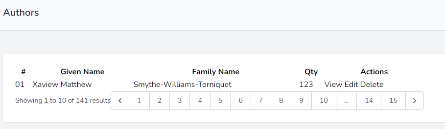

# Making a Web Application - Home Page

In this set of tutorials we create a web interface to act as a back-end management system.

The interface will use Blade and TailwindCSS in this initial configuration.

## BREAD Basics

During our initial creation of this application (before the API
tutorials), we created the Resourceful controller, models and
migrations plus other components of a web application.

We are now ready to create the BREAD activities for the web application.

We will create them WITHOUT authentication to begin with, and then build upon that base.

Remember that BREAD stands for Browse, Retrieve, Edit, Add and Delete.

## Tutorial Index
|                                      Previous                                       |                Index                 |                           Next                           |
|:-----------------------------------------------------------------------------------:|:------------------------------------:|:--------------------------------------------------------:|
| [Blade Home Page](ReadMe-51-Blade-HomePage.md) | [Tutorial Index](ReadMe-00-Index.md) | [55 Authors: Read](ReadMe-55-Blade-Authors-Read.md) |

## Authors Route

Open the `/routes/web.php` file.

We will add a resourceful route to begin with and modify later.

After the "/" or  "home" route, add the following:

```php
Route::resource('authors', AuthorController::class);
```

As we know from the API version, this will intercept and route the
`/authors` based requests including the GET method request for the
'index' or '/authors' route.

> **Remember** to import the AuthorController.

Now we can create the controller method to deal with the `/authors` request.

## Author Controller - index

Open the `app/Html/Controllers/AuthorController.php` file and locate the `index` method.

In this method we are going to add the code to retrieve authors, paginated with 10 authors per page.

We will also retrieve some other details about the author.

This method will then pass these details onto the 
`authors\index.blade.php` file (which we will create) to render the 
page as HTML.

Let's do the following:
- retrieve all the authors
- paginate these results
- send them to the `authors.index` view

```php
        $authors = Author::paginate(10);
        return view('authors.index', compact(['authors']));
```

Next we can create the view.

## Authors Index View

Begin by creating an `authors` folder in the `/resources/views` folder.

Inside here create a new file called `index.blade.php`.

We are now able to create the page based on the "guest layout".

Add this starter code:

```php
<x-guest-layout>
    <x-slot name="header">
        <h2 class="font-semibold text-xl text-gray-800 leading-tight">
            {{ __('Authors') }}
        </h2>
    </x-slot>

    <div class="py-12">
        <div class="max-w-7xl mx-auto sm:px-6 lg:px-8">
            <div class="bg-white overflow-hidden shadow-sm sm:rounded-lg">
                <div class="p-6 bg-white border-b border-gray-200">
                    ...
                </div>
            </div>
        </div>
    </div>
</x-guest-layout>
```

It looks very much like the 'home' page. And yes it is just that page altered slightly.

We now can work on displaying the data from the authors on this page.

Where the `...` are, we are going to add our output.

We will use a table that shows the information in a form similar to this:

|  #  |   Given Name    |    Family Name    | Qty |      Actions      |
|:---:|:---------------:|:-----------------:|:---:|:-----------------:|
| 01  | Xaview Matthew  | Smythe-Williams-Torniquet | 123 | View Edit Delete  |

Locate the `...` and enter the following:

```html
<table class="table">
    <thead>

    </thead>
    <tbody>

    </tbody>
    <tfoot>

    </tfoot>
</table>
```

This is our basic tabular layout. 

Next we add the headings between the `<thead>...</thead>`:

```html
<thead>
<tr>
    <th>#</th>  
    <th>Given Name</th>    
    <th>Family Name</th>
    <th>Corporate Author</th>
    <th>Qty</th> 
    <th>Actions</th>
</tr>
</thead>
```

The footer will use the pagination that is built into Laravel, so edit the `<tfoot>...</tfoot>` section and add:

```html
<tfoot>
<tr>
    <td colspan="5">
        {{ $authors->links() }}
    </td>
</tr>
</tfoot>
```

So we now have the table header and footer solved, lets add the contant itself.

We start with our demo line.

Between the `<tbody>...</tbody>` tags add:

```html
<tbody>
    <tr>
        <td>01</td>
        <td>Xaview Matthew</td>
        <td>Smythe-Williams-Torniquet</td>
        <td>N</td>
        <td>123</td>
        <td>
            View
            Edit
            Delete
        </td>
    </tr>
</tbody>
```
This gives us the following simple layout:



### Showing the results
Now we are able to replace the demo data with data from the Authors table.

Before the `<tbody>`'s `<tr>`, add the line 
```php
@foreach($authors as $author)
```
After the matching `</tr>` add the line:
```php
@endforeach
```

This will process each of the authors sent to it by the controller.

Next we replace the various parts of the `td` with their real data.

Let's start with the "given name".

### Given Name

Edit the `<td>...</td>` with the given name: "Xaview Matthew".

Replace the text with:
```php
{{ $author->given_name }}
```

### Family Name

The family name will be shown via:
```php
<td>{{ $author->family_name }}</td>
```

### Corporate Author
To display if the author is a corporate author, we use:
```php
<td>{{ $author->is_company }}</td>
```

### Book Count
The count of the books written by the author will be shown using:
```php
<td>{{ $author->family_name }}</td>
```

### Corporate Author Revisit

The corporate author is pretty crappy, it is shown as a 1 or a 0. Let's make it look more presentable.

Edit the Corporate Author content line:
```php
<td>{{ $author->is_company }}</td>
```

Change this to the following:
```php
<td>{{ $author->is_company ? "Y" : ""}}</td>
```

## Row Number

Some people like to display the record ID, but this is a bit of an issue if your rows start numbering the millions and billions.

Instead, we will just display a row number for the current page.

Replace the `<td>01</td>` in the table's body with:

```php
<td class="p-2 text-right">{{ $loop->iteration }}</td>
```

## Final code

The final code for the table as it stands is:

```php
<table class="table w-full">
    <thead class="border border-stone-300">
    <tr class="bg-stone-300">
        <th class="p-2 text-right">#</th>
        <th class="p-2 text-left">Given Name</th>
        <th class="p-2 text-left">Family Name</th>
        <th class="p-2 text-center">Corporate</th>
        <th class="p-2 text-right">Qty</th>
        <th class="p-2 text-left">Actions</th>
    </tr>
    </thead>
    <tbody class="border border-stone-300">
    @foreach($authors as $author)
        <tr class="border-b border-stone-300 hover:bg-stone-200">
            <td class="p-2 text-right">{{ $loop->iteration }}</td>
            <td class="p-2">{{ $author->given_name }}</td>
            <td class="p-2">{{ $author->family_name }}</td>
            <td class="font-bold text-stone-600 text-center">
                {{ $author->is_company ? "Y" : ""}}
            </td>
            <td class="p-2 text-right">
                {{ $author->books()->count() }}
            </td>
            <td class="p-2">
                View
                Edit
                Delete
            </td>
            @endforeach
        </tr>
    </tbody>
    <tfoot class="border border-stone-300">
    <tr>
        <td colspan="5" class="p-2">
            {{ $authors->links() }}
        </td>
    </tr>
    </tfoot>
</table>
```
