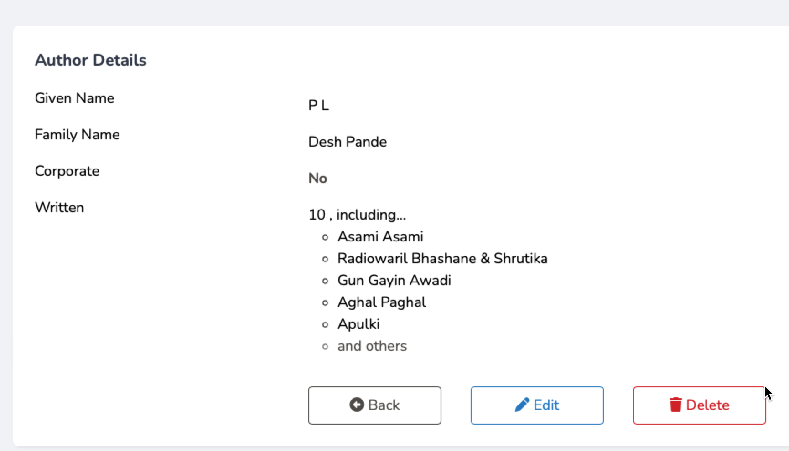

# Making a Web Application - Home Page

So we created the Browse page, with some features such as "view" "edit" and "delete"
 not functioning, plus no "add new" button.

We will fix that first item, by creating a "view" page.

## Tutorial Index
|                      Previous                      |                Index                 |                       Next                       |
|:--------------------------------------------------:|:------------------------------------:|:------------------------------------------------:|
| [54 Authors: Browse](ReadMe-54-Blade-Authors-Browse.md) | [Tutorial Index](ReadMe-00-Index.md) | [56 Authors: Edit](ReadMe-56-Blade-Authors-Edit.md) |

## Authors Route

We already have our Author routing taken care of by the use of the resourceful routing.

## Author Controller - show

Open the `app/Html/Controllers/AuthorController.php` file and locate the `show` method.

In this method we are going to add the code to retrieve a specified author, and their books.

This method will then pass these details onto the 
`authors\show.blade.php` file (which we will create) to render the 
page as HTML.

Let's do the following:
- retrieve the required author and their books
- send them to the `authors.show` view

```php
        $books = $author->with('books')->find($author);
        return view('authors.show', compact(['author','books',]));
```

Next we can create the view.

## Authors Index View

Open the `/resources/views/authors` folder.

Inside here create a new file called `show.blade.php`.

We are now able to create the page based on the "guest layout".

Add this starter code:

```php
<x-guest-layout>
    <x-slot name="header">
        <h2 class="font-semibold text-xl text-gray-800 leading-tight">
            {{ __('Authors') }}
        </h2>
    </x-slot>

    <div class="py-12">
        <div class="max-w-7xl mx-auto sm:px-6 lg:px-8">
            <div class="bg-white overflow-hidden shadow-sm sm:rounded-lg">
                <div class="p-6 bg-white border-b border-gray-200">
                    <h3 class="font-bold text-gray-700 text-lg mb-4">{{ __("Author Details") }}</h3>
                
                ...
                
                </div>
            </div>
        </div>
    </div>
</x-guest-layout>

```

We are now able to display the author details without using a table. This
Locate the `...` and enter the following:

```html
                    <div class="grid grid-cols-4">
                        <p class="">{{ __("Given Name") }}</p>
                        <p class="p-2 col-span-3">{{ $author->given_name }}</p>
                        <p class="">{{ __("Family Name") }}</p>
                        <p class="p-2 col-span-3">{{ $author->family_name }}</p>
                        <p class="">{{ __("Corporate") }}</p>
                        <p class="p-2 font-bold text-stone-600 col-span-3">
                            {{ $author->is_company ? "Yes" : "No"}}
                        </p>
                        
    ...

                    </div>
```

This section shows the main details for the Author, their name and if they are a corporate author.

Now we can add the details, such as a small selection (up to 5) of their books.

Locate the ... and replace with the following:

```html
<p class="">{{ __("Written") }}</p>
                        <div class="flex flex-col p-2 col-span-3">
                            <p class="">
                                {{ $author->books()->count() }}@if ($author->books()->count()>0)
                                    , {{ __("including") }}...
                                @endif
                            </p>
                            <ul class="list-circle list-inside pl-4">
                                @foreach($author->books as $book)
                                    @if($loop->index<5)
                                        <li>{{$book->title}}</li>
                                    @endif
                                @endforeach
                                @if($author->books()->count()>=5)
                                    <li class="text-stone-600">{{ __("and others") }}</li>
                                @endif
                            </ul>
                        </div>
                        
```
This shows the number of books they have written, or 0. 

If they have once or more books, then up to 5 have their titles displayed.

This relies on the many-to-many relationship we created in the models.

### A form to allow edits, deletes and going back

The final part of this is to add a form that allows us to go back, to edit or even delete the author.

```html
<div class=""></div>
<form action=""
      class="mt-6 col-span-3 flex flex-row gap-4">
    <a href="{{ route('authors.index') }}"
       class="py-2 px-4 mx-2 w-1/6 text-center
              rounded border border-stone-600
              hover:bg-stone-600
              text-stone-600 hover:text-white
              transition duration-500">
        <i class="fa fa-circle-left"></i> {{ __("Back") }}
    </a>
    <a href=""
       class="py-2 px-4 mx-2 w-1/6 text-center
              rounded border border-sky-600
              hover:bg-sky-600
              text-sky-600 hover:text-white
              transition duration-500">
        <i class="fa fa-pen"></i> {{ __("Edit") }}
    </a>
    <button type="submit"
            class="py-2 px-4 mx-2 w-1/6 text-center
                   rounded border border-red-600
                   hover:bg-red-600
                   text-red-600 hover:text-white
                   transition duration-500">
        <i class="fa fa-trash"></i> {{ __("Delete") }}
    </button>
</form>
```

The final look in action:


