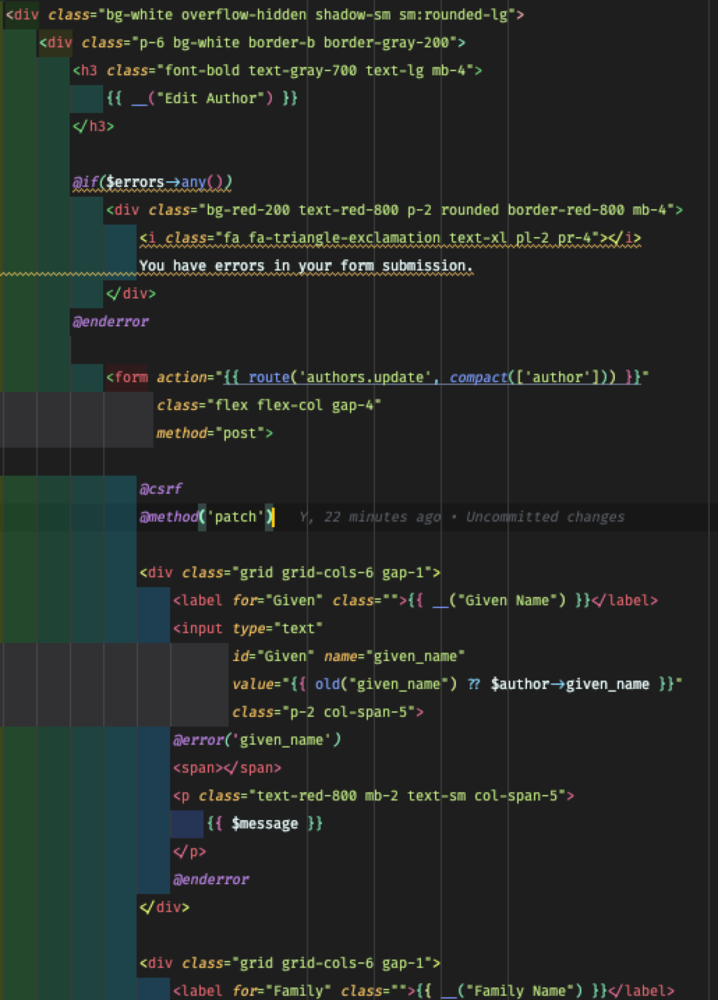
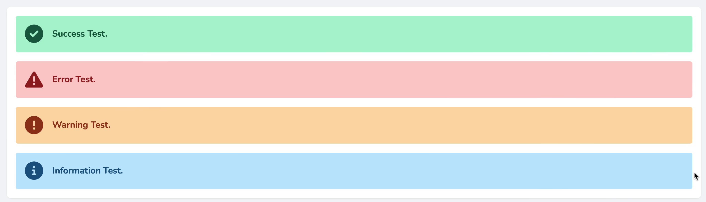

# Authors - Edit

Browse and Read are down, Edit is next.

## Tutorial Index
|                      Previous                       |                Index                 |                       Next                       |
|:---------------------------------------------------:|:------------------------------------:|:------------------------------------------------:|
| [55 Authors: Read](ReadMe-55-Blade-Authors-Read.md) | [Tutorial Index](ReadMe-00-Index.md) | [57 Authors: Read](ReadMe-57-Blade-Authors-Add.md) |

## Authors Edit Page

Create a new file `edit.blade.html` in the `/resources/views/author` folder.

In this file start as per the last two:

```php
<x-guest-layout>
    <x-slot name="header">
        <h2 class="font-semibold text-xl text-gray-800 leading-tight">
            {{ __('Authors') }}
        </h2>
    </x-slot>

    <div class="py-12">
        <div class="max-w-7xl mx-auto sm:px-6 lg:px-8">
            <div class="bg-white overflow-hidden shadow-sm sm:rounded-lg">
                <div class="p-6 bg-white border-b border-gray-200">
                    <h3 class="font-bold text-gray-700 text-lg mb-4">{{ __("Edit Author") }}</h3>
                
                ...
                
                </div>
            </div>
        </div>
    </div>
</x-guest-layout>
```

### Adding a General Error message

At the spot marked by the ... we now add the following (keep the ... as we will refer to it in the following steps):

```php
@if($errors->any())
    <div class="bg-red-200 text-red-800 p-2 rounded border-red-800 mb-4">
        <i class="fa fa-triangle-exclamation text-xl pl-2 pr-4"></i>
        You have errors in your form submission.
    </div>
@enderror

...
```

The code above first checks to see if there are `any()` errors.

If there errors then the general error message "*You have errors in your form submission*" is shown with an icon, pale red
background and dark red text.

### Adding the Form

Add the following lines before the ...:

```php
<form action="{{ route('authors.update', compact(['author'])) }}"
      class="flex flex-col gap-4"
      method="post">

    @csrf
    @method('patch')
```

and after the ... we want to add:

```php
</form>
```

These lines open the form, and set up CSRF protection. We also add a "method spoof" to mimic the "PATCH" verb.

Now we can work on each of the input fields.

### Given Name

We are going to use the same "template" for each of the inputs.

- a wrapper that is a grid with 6 columns and a 1/4 rem gap
- a label for the input which spans just 1 column
- the input which spans 5 columns
- an area to display the first of the errors for the field

Before the ... add the following:

```php
<div class="grid grid-cols-6 gap-1">
    <label for="Given" class="">{{ __("Given Name") }}</label>
    <input type="text"
           id="Given" name="given_name"
           value="{{ old("given_name") ?? $author->given_name }}"
           class="p-2 col-span-5">
    @error('given_name')
    <span></span>
    <p class="text-red-800 mb-2 text-sm col-span-5">
        {{ $message }}
    </p>
    @enderror
</div>
```

Important things in this 'component' are:

```php
value="{{ old("given_name") ?? $author->given_name }}"
```

This tells the input that first checks to see if there was an input in the text field, if not, then the content of the given
name from the author which is being edited is placed into the text field.

The `@error(...)` blade directive checks to see if there is an error for the `given_name` from the validation, if so, then
the error is displayed.

The whole fragment is then re-used for the family name, and is the basis for the corporate checkbox.

Here is a screenshot of the code in place:



### Family Name

Repeat for the Family name (short cut - duplicate the previous given name and edit).

```php
<div class="grid grid-cols-6 gap-1">
    <label for="Family" class="">{{ __("Family Name") }}</label>
    <input type="text"
           id="Family" name="family_name"
           value="{{ old("family_name")?? $author->family_name }}"
           class="p-2 col-span-5">
    @error('family_name')
    <span></span>
    <p class="text-red-800 mb-2 text-sm col-span-5">
        {{ $message }}
    </p>
    @enderror
</div>
```

### Corporate Checkbox

The corporate checkbox (aka is company) is a modified version of the text entry.

One thing to note is that we need to check the checkbox if the data from the author says that they are a company.

To do this we use the `@checked(...)` blade directive. This acts as an if statement and says:

*add "checked" to the inout attributes if either the old entry from the edit form submission, or the current author's data
says it is a company.*

```php
<div class="grid grid-cols-6 gap-1">
    <label for="Corporate" class="">{{ __("Corporate") }}</label>
    <input type="checkbox"
           id="Corporate" name="is_company"
           @checked(old('is_company') ?? $author->is_company)
           class="p-2 font-bold text-stone-600 col-span-5">
    @error('is_company')
    <span></span>
    <p class="text-red-800 mb-2 text-sm col-span-5">
        {{ $message }}
    </p>
    @enderror
</div>
```

### Show all the books by the author

Because of the nature of the author record, we are only able to show the books they have been credited with writing.

We use the same wrapping and then add the required loop to go through the author's books. The code below also limits the
number of books shown to at most 5.

```php
 <div class="grid grid-cols-6 gap-4">
    <p class="">{{ __("Written") }}</p>
    <div class="flex flex-col col-span-5">
        <p class="">
            {{ $author->books()->count() }}@if ($author->books()->count()>0)
                , {{ __("including") }}...
            @endif
        </p>
        <ul class="list-circle list-inside pl-4">
            @foreach($author->books as $book)
                @if($loop->index<5)
                    <li>{{$book->title}}</li>
                @endif
            @endforeach
            @if($author->books()->count()>=5)
                <li class="text-stone-600">{{ __("and others") }}</li>
            @endif
        </ul>
    </div>
</div>
```

At the moment, it is probably a good idea not to let the user edit a book direct from the edit the author. Instead it would
be prudent to modify the author details and allow the user to open the book for editing from there.

We may look at that later.

### Submit or Go Back

The final part of the form is where we submit the data to be saved, or we go back to the list of authors.

We use the same basic template, with a grid of 6 columns, but we then re-split it to allow for the buttons to be displayed.

Note that the back button is an ordinary HTML anchor (`a` element), whereas the save is a `button` element that is of type
submit.

```php
<div class="grid grid-cols-6 gap-4">
    <span></span>

    <div class="mt-6 col-span-5 flex flex-row gap-4 -ml-2">
        <a href="{{ route('authors.index') }}"
           class="py-2 px-4 mx-2 w-1/6 text-center
          rounded border border-stone-600
          hover:bg-stone-600
          text-stone-600 hover:text-white
          transition duration-500">
            <i class="fa fa-circle-left"></i> {{ __("Back") }}
        </a>

        <button type="submit"
                class="py-2 px-4 mx-2 w-1/6 text-center
           rounded border border-red-600
           hover:bg-red-600
           text-red-600 hover:text-white
           transition duration-500">
            <i class="fa fa-trash"></i> {{ __("Save") }}
        </button>
    </div>
```

For the full code, check the repository.

## The Author Controller - Edit Method

We have the view, so now we need to feed it.

Open the `AuthorController` and locate the `edit` method.

Modify the controller to read:

```php
   public function edit(Author $author)
    {
        return view('authors.edit', compact(['author',]));
    }
```

We are using Route-Model binding to automatically discover the Author's details and pass them to the view.

The `Author $author` in the method parameters requests Laravel to do "search for author with id X, and return it's full
details, or give a 404 error."

We have saved ourselves about 4 lines of code.

Next we add the code to do the author patch.

### Update Author

A little trick we can use is to use the validated data fromt eh UpdateAuthorRequest to 'patch' the author.

To do this we loop through the `$request->validated()` data and extract the *key:value* pair. These then are applied to the
Route Model bound `$author` to patch the record.

Once all the updated validated fields are 'patched' the author is saved with these changes.

The best bit? We did not have to check each field in turn, as (1) they have been validated, and (2) only the fields with
validation rules applied are returned.

Finally we redirect the page back to the authors index page, and send a 'success' message back.

```php
public function update(UpdateAuthorRequest $request, Author $author)
    {
        foreach ($request->validated() as $validKey => $validValue) {
            $author[$validKey] = $validValue;
        }

        $author->save();

        return redirect()->route('authors.index')
            ->with('success', 'Author updated successfully.');
    }
 ```

Before we can use this we need to create an UpdateAuthorRequest.

### UpdateAuthorRequest

Create the request using:

```shell
sail artisan make:request UpdateAuthorRequest
```

Edit the request by changing the `authorize` method to `return true` and then adding the following validation rules:

```php
    public function rules()
    {
        return [
            'given_name' => [
                'required_without:family_name',
                'max:64',
            ],
            'family_name' => [
                'required_without:given_name',
                'max:128',
            ],
            'is_company' => [
                'boolean',
            ]
        ];
    }
```

We do not need to add a constructor or anything else to this as Laravel will handle sending the errors back as part of an
"error bag".

With that we should now have a working edit page.

### What about the links to the edit?

Oh... remember to update the links for the edit buttons on the Author Read (Show) and the Author Browse (index) pages.

The index page edit link will be similar to this:

```php
<a href="{{ route('authors.edit', compact('author')) }}"
   class="px-2 w-12 text-center rounded-md border border-sky-600
          hover:bg-sky-600 hover:text-white transition duration-500">
    <span class="sr-only">Edit</span>
    <i class="fa fa-pen"></i>
</a>
```

The show page edit link will be similar to the following:

```php
<a href="{{ route('authors.edit', compact('author')) }}"
   class="py-2 px-4 mx-2 w-1/6 text-center rounded border border-sky-600
          hover:bg-sky-600 text-sky-600 hover:text-white
          transition duration-500">
    <i class="fa fa-pen"></i> {{ __("Edit") }}
</a>
```

## Flash Messages!

Before we use the flash messages, we need top build a little 'message' blade file.

Go to the `resources\views\layouts` folder and create a new file `messages.blade.php`.

This file consists of five sections:

- The wrapper to allow it to stand out at the top of the page when a message needs to be displayed.
- The Success message
- The Error message
- The Warning message
- The Information message

The message blocks are basically the same with only and icon and the colour changing.

Here is the success message code:

```php
@if (session('success'))
    <div class="flex flex-row gap-4 bg-emerald-200 text-emerald-800 p-4 m-4 rounded">
        <i class="fa fa-check-circle fa-2x"></i>
        <strong class="pt-1">{{ session('success') }}</strong>
    </div>
@endif
```

Here is an image showing the four messages:



Ok, now we can add the full code for the 'flash message' display.

In the `messages.blade.php` file add the code below:

```php
<div class="pt-6 -mb-8">
    <div class="max-w-7xl mx-auto sm:px-6 lg:px-8">
        <div class="bg-white overflow-hidden shadow-sm sm:rounded-lg">

            @if (session('success'))
                <div class="flex flex-row gap-4 bg-emerald-200 text-emerald-800 p-4 m-4 rounded">
                    <i class="fa fa-check-circle fa-2x"></i>
                    <strong class="pt-1">{{ session('success') }}</strong>
                </div>
            @endif

            @if (session('error'))
                <div class="flex flex-row gap-4 bg-red-200 text-red-800 p-4 m-4 rounded">
                    <i class="fa fa-triangle-exclamation fa-2x"></i>
                    <strong class="pt-1">{{ session('error') }}</strong>
                </div>
            @endif

            @if (session('warning'))
                <div class="flex flex-row gap-4 bg-orange-200 text-orange-800 p-4 m-4 rounded">
                    <i class="fa fa-circle-exclamation fa-2x"></i>
                    <strong class="pt-1">{{ session('warning') }}</strong>
                </div>
            @endif

            @if (session('info'))
                <div class="flex flex-row gap-4 bg-sky-200 text-sky-800 p-4 m-4 rounded">
                    <i class="fa fa-circle-info fa-2x"></i>
                    <strong class="pt-1">{{ session('info') }}</strong>
                </div>
            @endif

        </div>
    </div>
</div>
```

Edit the guest.blade.php and the app.blade.php files and modify the code around the `{{ $slot }}`:

```php
    <main class="flex-grow">

        @include('layouts.messages')

        {{ $slot }}

    </main>
```

This should now add the success when the author is edited successfully.

## and next... Add

The best part of doing the edit first is that you have basically solved what you need to do for the add.

So time to get into "Add Author".
