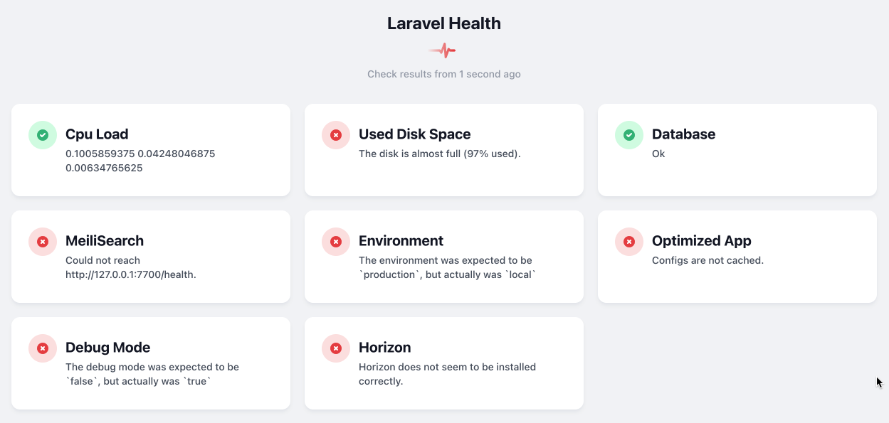

# Monitoring Application Health

It is a good idea to have a quick way to monitor your applicaition's health.

Health, int eh case of an applicaiton, includes items such as checking:
- Database server is running
- Cloud Storage availability
- Disk storage usage
and more.

This stage uses the Spatie Health Monitoring package, otherwise known as [Laravel Health](https://github.com/spatie/laravel-health).

Full documentation for the package is found at:
- [https://spatie.be/docs/laravel-health/v1/introduction](https://spatie.be/docs/laravel-health/v1/introduction).


## Tutorial Index
- [Setting Up](ReadMe-00-Setting-Up.md) 🔗
- [Introduction](ReadMe-10-API-introduction.md) 🔗
- [Index and Show](ReadMe-11-API-index-show.md) 🔗
- [Create](ReadMe-12-API-create.md) 🔗
- [Update](ReadMe-13-API-update.md) 🔗
- [Delete](ReadMe-14-API-delete.md) 🔗
- [Documenting API](ReadMe-15-API-documenting.md) 🔗
- [Pagination](ReadMe-16-API-pagination.md) 🔗
- [Authentication](ReadMe-20-API-authentication.md) 🔗
- [Authorisation](ReadMe-21-API-authorisation.md) 🔗
- [Exercises](ReadMe-90-API-exercises.md) 🔗
- [Useful Links](ReadMe-99-Links.md) 🔗
---

## Installation of Laravel Health

Run the following commands:

```shell
sail composer install
sail composer update
sail composer require spatie/laravel-health
```
We make sure any missing packages are installed, then update the 
packages before finally installing laravel health.

Publish the configuration file:
```shell
sail artisan vendor:publish --tag="health-config"
```

Run the migrations:
```shell
sail artisan vendor:publish --tag="health-migrations"
sail artisan migrate
```

## Setting Automatic Health Checks

In the `app/Console/Kernel.php` file we need to modify the `schedule` call.

The default schedule contains a commented out call to 'inspire'. We 
are adding a new line as given below:

```php
// $schedule->command('inspire')->hourly();
$schedule->command(\Spatie\Health\Commands\RunHealthChecksCommand::class)->everyMinute();
```

## Create Health Service Provider

Creating the service provider stub is easy:

```shell
sail artisan make:provider HealthServiceProvider
```

## Add Service Provider to the Application

Open the config/app.php file and scroll down to the Application 
Service Providers section:

```php
        /*
         * Application Service Providers...
         */
        App\Providers\AppServiceProvider::class,
        App\Providers\AuthServiceProvider::class,
        // App\Providers\BroadcastServiceProvider::class,
        App\Providers\EventServiceProvider::class,
        App\Providers\RouteServiceProvider::class,
```

At the end of this list add:

```php
App\Providers\HealthServiceProvider::class,
```


## Storing Results

For this example, we will store the results of the health checks in the database.

Open the `config\health.php` file.

By default, the data is stored in the database, and expires
after 5 days. In practice, you may want to keep a longer period
of time, depending on what you are monitoring.

You can enable multiple stores if you wish, including a JSON
file, In Memory and others.

## Monitoring the Disk Health

Edit the `\app\Providers\HealthServiceProvider.php` file.

Add the following `use` lines:

```php
use Spatie\Health\Facades\Health;
use Spatie\Health\Checks\Checks\UsedDiskSpaceCheck;
```

Next, in the `HealthServiceProvider` add the following to the `register`:

```php
UsedDiskSpaceCheck::new()
    ->failWhenUsedSpaceIsAbovePercentage(80)
    ->warnWhenUsedSpaceIsAbovePercentage(50),
```


## Monitoring CPU Usage

Add the additional package:
```php
sail composer require spatie/cpu-load-health-check
```


In the `HealthServiceProvider` add the following to the use lines:
```php
use Spatie\CpuLoadHealthCheck\CpuLoadCheck;
```

Next in `register` add the CPU Load Check:

```php
CpuLoadCheck::new()
        ->failWhenLoadIsHigherInTheLast5Minutes(2.0)
        ->failWhenLoadIsHigherInTheLast15Minutes(1.5),
```


## Monitoring Database Server

The database server checks are also easy to add.

The required `use` line:

```php
use Spatie\Health\Checks\Checks\DatabaseCheck;
```

Then the `register` method gets an additional line:

```php
public function register()
    {
        Health::checks([
            CpuLoadCheck::new()
                ->failWhenLoadIsHigherInTheLast5Minutes(2.0)
                ->failWhenLoadIsHigherInTheLast15Minutes(1.5),
            DatabaseCheck::new(),
            UsedDiskSpaceCheck::new()
                ->failWhenUsedSpaceIsAbovePercentage(80)
                ->warnWhenUsedSpaceIsAbovePercentage(50),
        ]);
    }
```

## Other possible monitoring configurations

You able to monitor, out of the box, the following:
- Application Cache
- Cached config, routes, and events
- CPU load
- DB connection
- DB connection count
- DB table size
- Debug mode
- Environment
- Flare error count
- Horizon
- MeiliSearch
- Ping
- Redis
- Schedule
- Security advisories
- Used disk space

SAee the Spatie Health Documentation: [Laravel-Health Checks](https://spatie.be/docs/laravel-health/v1/available-checks/overview)

## Dashboard

Open your `routes\web.php` file and add the following `use` and `route` definitions:

After other `use` lines add:

```php
use Spatie\Health\Http\Controllers\HealthCheckResultsController;
```
At some point, probably at the end of your route definitions, add:

```php
Route::get('health', HealthCheckResultsController::class);
```

## API Endpoint

In teh `routes/api.php` file we can add a healthcheck to return results as JSON:

```php

/**
 * Using Spatie's Health package
 */
Route::get('health', HealthCheckJsonResultsController::class);
```

An example of the Health Check web output is shown below:




## Customising the Health Dashboard

You can customise the dashboard by first publishing the health views:

```shell
sail artisan vendor:publish --tag=health-views
```

After that the views are found in the `resources/views/vendor/health` folder.

> Note (2022-09-27):
> 
> We have had issues publishing the components for the views.
> We will investigate, and as required, report an issue to Spatie.

